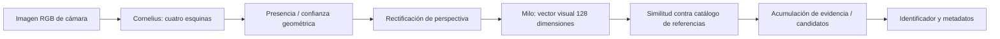

# CollectorVision: prueba móvil y port nativo

Fecha: 25/09/2026. Rama: `codex/rules-scanner`.

## Precio, único sonido y miniatura opcional (25/09/2026)

Se elimina ACK al obtener datos/guardar: solo BEEP al aceptar reconocimiento.
Precio junto a miniatura de la **última carta aceptada**, consultado asíncronamente
con metadatos Scryfall por UUID exacta, acabado capturado al reconocer y moneda EUR/USD
seleccionada en app. Fuente explícita Scryfall, puede diferir del proveedor de Biblio.
Sin precio (p. ej. etched EUR), mostrar no disponible, nunca usar precio nonfoil.
No retrasa aceptación/guardado; caché en sesión y callbacks de otra UUID no pisan precio actual.
Check persistente «Mostrar miniatura analizada», activado por defecto. Al apagar se
omite escalado/copia/Canvas del snapshot y se libera bitmap visible; no se oculta solo
la View. Mantiene cámara, inferencia, precio y guardado. Ganancia real pendiente de medir.
Validado: 427 pruebas JVM, 7 instrumentales Sony OK (10,242 s), incluyendo miniatura
oculta con cámara activa, persistencia del flag y precio foil sin fallback etched.
APK instalada `-r`, SHA256 `b195331fff502f45a9a722ef32dbc6063229d5ecb48f0051499beafa023d0328`.
Sin inserciones de prueba en la Biblio.

## Flag de aceptación (25/09/2026)

Check «Filtros de seguridad» en Cornelius, persistido al cerrar/reabrir; activado por defecto.
- Activado: política previa de 3 lecturas ≥0,70 y margen ≥0,08.
- Desactivado (rápido): primera lectura con carta presente y candidato ≥0,50; sin margen ni repeticiones. Mayor riesgo de falsos positivos.
- Conserva bloqueos de duplicados, fallos y guardado pendiente al cambiar modo. No modifica modelos ni acelera inferencia: elimina la espera de confirmación.
- Los dos sonidos siguen indicando aceptación y guardado por separado. Idioma/acabado siguen siendo manuales.

Validación del flag: 427 pruebas JVM sin fallos y 6 instrumentales Sony OK (6,744 s),
incluida persistencia del check al recrear y reabrir. APK instalada con `-r`, SHA256
`75c914387debeb6a2a4f50c4b0031515c40cf4ceb7308fd570d29b65de031b93`.
No se añadieron cartas de prueba a Biblio. Comparación física de rapidez/errores pendiente.

## Actualización: sonido, Biblio y preview independiente

### Señales separadas de reconocimiento y guardado

Actualización posterior: primer BEEP corto al aceptar las tres lecturas fiables, antes
del lookup de datos; segundo ACK distinto tras resolver impresión y confirmar guardado.
Un fallo no emite ACK. Separación mínima de 180 ms entre inicios para que una respuesta
de caché no corte el primer tono. Al salir se cancela cualquier ACK pendiente.
El primer sonido permite retirar la carta, pero no significa todavía que esté guardada.
No se ha modificado la política de confianza ni las cantidades.

`CorneliusTiming` registra `recognized` y `saved dataAndSaveMs` para distinguir coste de
inferencia de espera de catálogo/guardado. El lookup no solicita precios expresamente
(construye opciones sin precios), aunque comparte ejecutor con tareas de catálogo.

Validación: 423 pruebas JVM (404 app + 19 módulo) correctas, build correcto, instalación
`-r` Sony QV770HG2JD. 5 instrumentales OK (5,532 s): host sin escritura, resolución UUID
exacta, modelos/foto real, cámara y reanudación. No se insertaron cartas de prueba en la
biblioteca real: guardado/grupos/idioma cubiertos por unitarias, flujo físico pendiente
del usuario. SHA APK `34f388fc1463c5246f66a759fddd1203b10605f3abc6e693ff27a2c21fc50511`.

La entrada de la app ahora es `CorneliusScanActivity`, subclase host de la Activity
nativa. El módulo continúa sin dependencia de Room/Biblio. El host recibe un candidato
fiable y responde al callback después de guardar legacy y selección Room.

- Gate inicial conservador: 3 lecturas consecutivas con score >= 0,70 y margen >= 0,08
  frente a otra UUID. No representa una probabilidad calibrada ni garantía de edición.
- Una copia por presentación; mantener carta, pausar o un candidato ambiguo no suman.
  Dos lecturas sin carta permiten otra copia. Guardar otra UUID permite volver a la anterior.
- Sonido corto de confirmación tras guardado correcto, no al dibujar el marco. Respeta
  volumen multimedia; no suena por callbacks que llegan con pantalla detenida.
- Cada sesión reserva perezosamente Cornelius N en la biblioteca activa: contador
  persistente y máximo de grupos existentes. No crea grupo vacío por abrir la pantalla.
- Filas aisladas por sesión/idioma/acabado: no se trasladan copias antiguas a la nueva
  agrupación. La consolidación legacy preserva estas filas al reabrir la app.
- Lookup exacto Scryfall UUID -> impresión local; no sustitución por primera edición.
  Falta de caché puede cargar el set. Acabado seleccionado no disponible: no guarda.
- Idioma manual, inicialmente desconocido; nunca se toma EN de la referencia como idioma
  físico. Selector acabado nonfoil/foil/etched manual. Todavía no hay OCR de idioma.
- Fallo bloquea esa carta hasta retirarla o guardar otra; evita tormentas de reintentos.

### Cámara y siguientes optimizaciones

Antes se mostraba el bitmap al finalizar la inferencia: la imagen visible iba al ritmo
del modelo. Ahora CameraX PreviewView muestra cámara directamente e ImageAnalysis usa
KEEP_ONLY_LATEST por separado. La miniatura con quad representa el frame analizado, no
un overlay desfasado sobre vídeo. Miniatura limitada a 360 px para reducir copias.

Esto desacopla la fluidez de cámara, no acelera automáticamente ONNX ni añade tracking.
Siguientes experimentos: medir p50/p95 por etapa y calor; reutilizar orientación después
de estabilizar, evitar embeddings repetidos de la misma carta y evaluar búsqueda vectorial
optimizada. Cualquier caché debe invalidar al retirar/cambiar carta. OCR de idioma podría
ejecutarse una vez por candidato estable, no por frame. Mantener CPU como referencia;
no activar GPU/quantización sin comprobar equivalencia de resultados.

Prueba física pendiente: guardar una carta (un sonido), mantenerla 5 segundos (ninguna
copia extra), retirarla hasta perder detección y reintroducirla (otra copia); cerrar y abrir
otra sesión (Cornelius N+1), revisar grupos/cantidades y seleccionar idioma PT manualmente.
Probar también acabado no disponible y confirmar que no guarda ni suena.

## Actualización: port nativo solicitado

### Validación nativa realizada

- Build correcto con ONNX Runtime Android **1.20.0**: mantiene minSDK23. 1.22 exigía
  Android24 y se descartó, sin `overrideLibrary` ni subida de minSDK global.
- 402 pruebas JVM app + 6 módulo = **408 correctas**, ninguna omitida/error/fallo.
- Instalación `-r` Sony XQ-DQ54 `QV770HG2JD`, sin borrar datos.
- **3 instrumentales OK (4,559 s)**: Activity privada/cierre, modelos reales+catálogo
  y CameraX con frame procesado + detener/reanudar y recibir nuevo frame.
- El test físico usa original privado `1790341616029` (Titanic), no empaquetado:
  primera medición válida detector **41 ms**, identificación **212 ms**, score
  **0,7686697**, UUID `3f42c4d7-b555-449c-a539-119c1ae62232`.
  Consulta Scryfall confirmó **Titanic Bulvox, SCG #129**. No demuestra idioma/acabado
  físico ni precisión general. Blanco rechazado: sharpness 0,007558 < 0,02.
- SHA256 APK: `7ee05f40396d4c3787f2ce12efc43d0536ca8f5208b4aa2ab5a4360f1531224d`.
- El primer intento del test de foto falló porque el fixture ADB llegó truncado;
  corregido con transferencia binaria `exec-in` y verificación SHA de 78.381 bytes.
- Pendiente prueba física del usuario: soporte, bordes blancos, cartas parecidas,
  cambios rápidos, latencia prolongada/calor y exactitud de impresión. No hay tracking
  óptico entre frames ni autoañadido en esta primera versión del port.

La fase web de abajo queda histórica. El usuario solicita el port definitivo aislado:
el botón ahora abre `NativeCollectorVisionActivity` del módulo `:collectorvision-native`.
No utiliza WebView, Python ni servidor de inferencia. CameraX → Cornelius → OpenCV
warp → Milo (0°/180°) → catálogo local con top 3. CPU FP32 inicialmente.

Módulo sin dependencias de `app`, Room ni proveedores de colección. La app solo declara
dependencia y navega a su Activity. Modelos/catálogo (~42,1 MB) se descargan explícitamente
la primera vez, con tamaño y SHA256 fijados; no se publican bytes parciales. La caché
privada no entra en backup. Los modelos se mantienen en memoria durante la Activity.
Después de preparar, la inferencia funciona con assets locales. El nombre/set se
enriquece por UUID mediante Scryfall en otro ejecutor; el reconocimiento no espera red.

La pantalla muestra el frame exacto procesado con sus esquinas (no overlay sobre un
preview de otra geometría), tiempos separados detector/identificación y UUID/score.
Exige dos resultados consecutivos para la etiqueta de candidato estable, no garantiza
edición física/idioma/acabado ni autoañade a la Biblio. Un cambio/ausencia borra el candidato.
El seguimiento óptico entre detecciones queda pendiente: primero medir este baseline.

Fuentes/atribución y licencia en `collectorvision-native/NOTICE.md` y `LICENSE`.
Separar un módulo NO resuelve por sí mismo obligaciones de licencia de distribución.
No se ha publicado ni subido este port; revisar compatibilidad o licencia alternativa
antes de distribuirlo fuera de esta prueba local.

## Estado de entrega

- Botón **CollectorVision · Lab**, Activity independiente y seis idiomas implementados
  por subagente y revisados por agente principal.
- 402 pruebas JVM correctas; APK y APK instrumental compilados.
- Instalados con `install -r` en Sony XQ-DQ54 `QV770HG2JD`, sin borrar datos.
- `CollectorVisionLabDeviceTest`: 3 pruebas OK en Sony (3,408 s): manifest privada,
  shell sin carga de red, permiso pendiente cancelado al detener Activity.
- SHA256 APK: `4d663d8b0ee9e6306c0e60dd4c022afe34cb2927d8f7639ac71d01388586415d`.
- Estas pruebas NO verifican descarga de modelos, inferencia, cámara web real ni
  precisión/velocidad. Es la siguiente prueba manual del usuario.

## Alcance de esta primera prueba

Botón independiente hacia una Activity de laboratorio que muestra el escáner web
oficial. No es un port nativo ni sustituye nuestros escáneres. La biblioteca local
y sus cantidades/idiomas/acabados no se modifican. La web puede mantener su propia
sesión y caché. Requiere Internet para carga inicial y recursos externos; no promete
funcionar completamente offline. No se empaqueta código ni modelos de CollectorVision.

El usuario solicita implementación por subagente; `collectorvision_lab` se ocupa
del punto de entrada, Activity aislada y validaciones.

## Cómo reconoce

No es simplemente un pHash más grande ni OCR de todas las letras. El detector aprende
esquinas de cartas; el segundo modelo aprende una representación visual para búsqueda.
El código describe entrenamiento de Milo con ilustración y set. Esto NO garantiza
distinguir toda impresión, idioma o acabado: hay que medirlo y conservar nuestras
reglas para diferencias no visibles o candidatos ambiguos.

Registro upstream consultado:
- Cornelius 2.12: MobileViT-XXS + SimCC, entrada RGB 384×384; ONNX 4.407.545 bytes,
  SHA256 `650da3cc3e9ac778c6951de631f824ec1e63bdabf3aaa39a35d7435af625612e`.
- Milo 1.0.0: MobileViT-XXS + ArcFace, entrada RGB 448×448; vector normalizado de
  128 float32, ONNX 5.191.100 bytes,
  SHA256 `bd13d8d60383c69da04dce261f32e93fdaeaa8fd618fbc991e7385f71b3d45df`.
- El tamaño de estos dos ficheros NO incluye catálogo, runtime, activaciones ni RAM total.
- Cornelius utiliza nitidez de distribuciones SimCC como puerta de presencia cuando
  existe esa salida; el propio código advierte que el logit de presencia puede disparar
  sobre imágenes vacías. No confundir esta nitidez estadística con enfoque óptico.

La demo usa ONNX Runtime Web; WASM es el valor inicial y WebGPU es opt-in.
Su documentación advierte problemas de resultados WebGPU en Android ARM: comenzar
por WASM, no activar GPU suponiendo que siempre es más rápida o equivalente.
Los modelos/catálogos se cachean en IndexedDB y el enriquecimiento Scryfall es posterior
a confirmación según el código consultado. Esto no sustituye una auditoría de privacidad.
La demo alojada puede evolucionar: registrar su Build ID, backend y modelos en pruebas.

## Viabilidad del port

Técnicamente viable: los modelos ya son ONNX y ONNX Runtime dispone de paquete Android
para Java/C/C++. No hace falta ejecutar Python ni reescribir las redes en Kotlin.
Sí hay que implementar/adaptar:

1. CameraX → RGB con rotación/crop/stride correctos; mismo resize y normalización.
2. Inferencia de esquinas, umbrales y validación de cuadrilátero.
3. Rectificación equivalente y preparación exacta de Milo; comprobar imágenes a 180°.
4. Catálogo versionado, descarga/caché y búsqueda de similitud eficiente.
5. IDs hacia nuestras impresiones; no escoger primera edición o idioma del catálogo.
6. Ciclo de vida, memoria de tensores, hilos, cancelación y cola de último frame.
7. Licencias de código, pesos y catálogos antes de distribuir la integración.

Primero CPU/FP32 reproducible; después comparar XNNPACK/aceleradores. Medir precisión
además de latencia antes de INT8/FP16 o reducción de resolución. El proveedor puede
particionar operaciones y resultar más lento. Un resultado WebView lento no descarta
el port nativo; una demo PC rápida tampoco demuestra rendimiento en Sony.

## Papel de OpenCV

Propuesta posterior, no implementada en esta prueba: Cornelius relocaliza; OpenCV
rectifica y sigue puntos interiores entre detecciones. Revalidar periódicamente y
resetear al cambiar/retirar carta, perder confianza o cambiar cámara/zoom. No arrastrar
el resultado anterior a la carta siguiente. Comparar primero CollectorVision solo
para no mezclar efectos del nuevo tracking con efectos del modelo.

## Protocolo de prueba real

- Usar Sony con WASM y Wi-Fi para primera carga; anotar Build ID/backend/modelos.
- Separar tiempo de descarga/arranque del tiempo por carta.
- Repetir las mismas cartas en mano y soporte: borde blanco/negro, antiguas, foil,
  perspectiva, sombra, dedo, carta parcial y escena vacía.
- Comprobar borde físico, identificación, edición e idioma POR SEPARADO.
- Cambiar carta rápido: nunca aceptar la identidad de la anterior.
- Diez aperturas/cierres y volver al OCR original para detectar retención de cámara.
- Probar varios minutos: p50/p95 si la demo expone medición, calentamiento y batería.
- Si WebView falla, contrastar la misma demo en Chrome móvil, documentando que es otro
  entorno. No atribuir el fallo automáticamente al modelo.
- No hay autoañadido a nuestra Biblio ni integración de resultados en esta fase.

## Fuentes primarias

- https://github.com/HanClinto/CollectorVision
- https://github.com/HanClinto/CollectorVision/blob/main/collector_vision/detectors/neural.py
- https://github.com/HanClinto/CollectorVision/blob/main/collector_vision/embedders/neural.py
- https://github.com/HanClinto/CollectorVision/blob/main/collector_vision/data/model_registry.json
- https://github.com/HanClinto/CollectorVision/blob/main/examples/web_scanner/app.js
- https://github.com/HanClinto/CollectorVision/blob/main/docs/edge_model_optimization.md
- https://github.com/HanClinto/CollectorVision/blob/main/COMMERCIAL_LICENSE.md
- https://onnxruntime.ai/docs/tutorials/mobile/

La página del autor ofrece AGPL-3.0 y vías separadas no comercial/comercial. No asumir
que la vía personal cubre nuestra app con funciones Premium; revisar términos concretos
o contactar al autor antes de distribuir un port. Esta nota no es asesoramiento legal.
