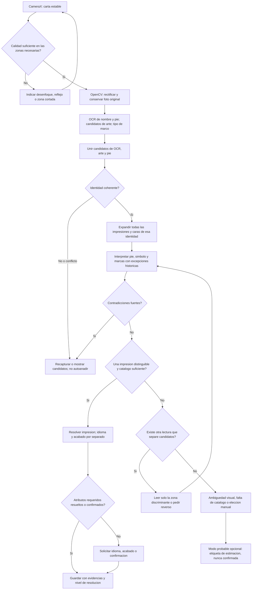
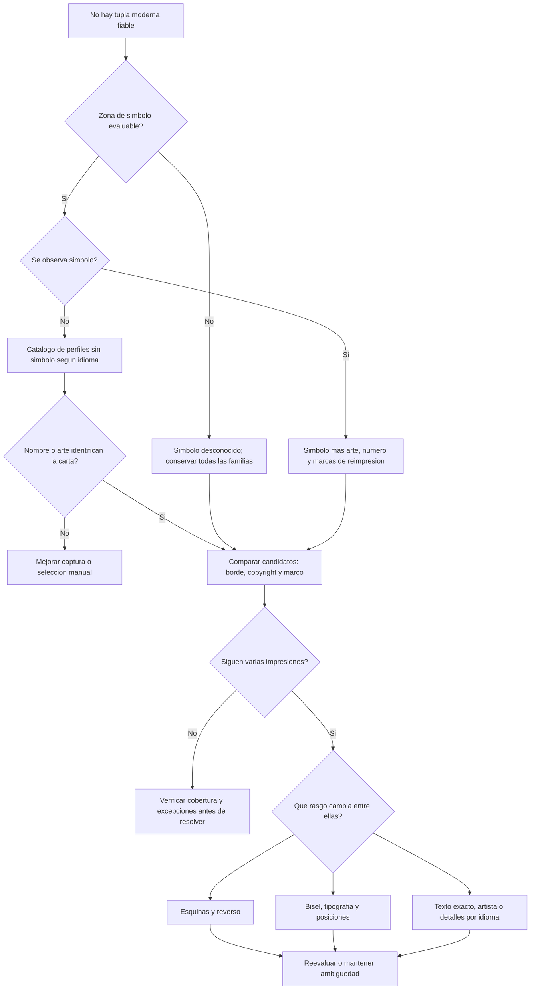
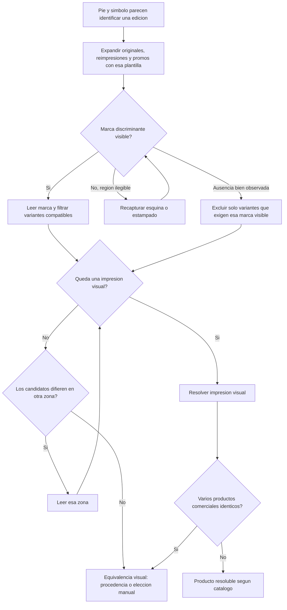
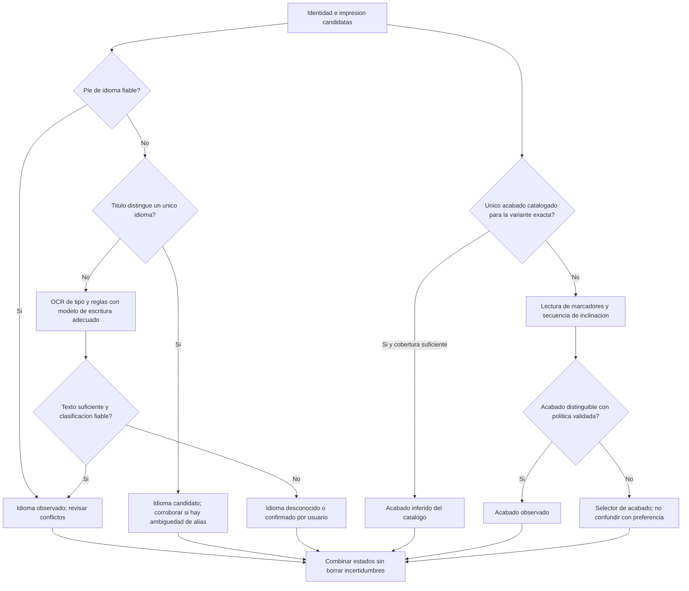
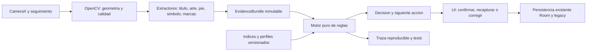

# Identificación de cartas de Magic: reglas y resolución por evidencias

**Versión:** propuesta 1.0 · **Consulta de fuentes:** 23 de septiembre de 2026.

**Destino:** evolución de `feature/improbe-hash-scanner` con CameraX, OpenCV, OCR e índices locales. **Estado:** investigación y diseño; este documento no implementa ni cambia el comportamiento de la APK.

## 1. Resumen: qué debemos identificar realmente

No conviene construir un árbol del tipo «hash → edición». La solución propuesta es **reconocer la identidad, reunir todas sus impresiones candidatas y resolver las diferencias con evidencias de esta carta física**. El árbol decide qué leer después; el catálogo decide qué alternativas siguen siendo posibles.

Hay seis preguntas diferentes:

| Nivel | Pregunta | Ejemplo de resultado |
|---|---|---|
| Identidad | ¿Qué carta es, independientemente de edición e idioma? | Identidad Oracle o equivalente; nombre canónico para búsqueda. |
| Ilustración y cara | ¿Qué arte y qué lado estamos viendo? | `illustrationId`, cara frontal/trasera/mitad. |
| Impresión | ¿Qué versión editorial concreta es? | UUID de impresión, set, número y variante visual. |
| Idioma físico | ¿Qué idioma está impreso? | `es`, `pt`, `ja`, desconocido… No el idioma de la app. |
| Acabado y tratamiento | ¿Nonfoil, foil, etched? ¿Retro, extended, showcase, serializada…? | Acabado y tratamiento separados; ambos pueden estar pendientes. |
| Producto y ejemplar | ¿Qué referencia comercial corresponde? ¿Tiene serial individual? | ID del proveedor, procedencia si hace falta, serial `n/total`. |

La condición, cantidad, firma de propietario, alteración y pertenencia a una colección son atributos adicionales del ejemplar. No deben decidir la impresión automáticamente.

**Límite fundamental:** algunas versiones comparten todos los rasgos visibles; una cámara no puede recuperar una procedencia que no está codificada en la carta. «Exacta» siempre debe indicar a qué nivel lo es y respecto a qué catálogo. Identificar tampoco autentifica: una reproducción puede copiar todos los datos visibles.

La separación entre identidad Oracle, ilustración e identificadores de proveedores está respaldada por [MTGJSON: Identifiers](https://mtgjson.com/data-models/identifiers/). La estructura de seis niveles y las políticas siguientes son **propuesta propia para esta app**, no una norma de Wizards.

### Flujo principal



## 2. La guía aportada: útil, pero no debe convertirse literalmente en código

He revisado [How to Easily Identify Magic Sets, de Three for One Trading](https://www.threeforonetrading.com/en/identify-magic-sets). Aporta buenas pistas: posición del título y del crédito artístico en Unlimited/Revised, símbolos promocionales compartidos, cartas sin texto y ambigüedad entre The List y Mystery Booster. Su estrella promocional no debe confundirse con la estrella del foil retro.

**Adaptación propuesta:** tratarla como una lista de observaciones, no como una taxonomía exhaustiva. Expresiones como «exactamente seis» no son un contrato válido para un catálogo cambiante. La explicación de FBB como mezcla de ediciones es demasiado simplificada para resolver UUIDs; necesitamos set e idioma documentados. Y una coincidencia de símbolo no basta para determinar el producto comercial.

La revisión se completa con documentación de Wizards, modelos de MTGJSON, la guía de Cardmarket y el estudio original de variantes de The Green Disenchant Project. No se copian imágenes ni tablas completas de esas guías.

## 3. Historia visual que condiciona el reconocimiento

Las fechas indican introducciones o familias, **no cortes absolutos**: se reimprimen marcos antiguos, pies y símbolos. No deducir el año de fabricación solamente del aspecto del marco.

| Época / hito | Dato relevante | Consecuencia para el escáner |
|---|---|---|
| 1993: Alpha, Beta, Unlimited | Básicas iniciales sin símbolo ni número impreso. | Nombre/arte, bordes, esquinas, tipografía y texto de esa impresión. Un número asignado por una base de datos no implica que esté impreso. |
| 1993–1997: primeras expansiones | Los símbolos de expansión ya aparecen con Arabian Nights; antes de Exodus no codifican normalmente la rareza por color. | Símbolo negro no equivale a común. [Historia oficial](https://magic.wizards.com/en/news/making-magic/collecting-my-thoughts-2004-04-26), [anatomía de carta](https://magic.wizards.com/en/news/feature/anatomy-magic-card-2006-10-21). |
| 1994–1997: básicas e idiomas | Los pies y bordes varían según edición e idioma. | Perfil regional; no reutilizar sin más un árbol diseñado para cartas inglesas. |
| 1998: Exodus | Introducción de numeración de colección y símbolos coloreados por rareza. | Nueva ruta de número + símbolo + nombre/arte. [Wizards](https://magic.wizards.com/en/news/making-magic/which-came-first-2022-03-14). |
| 1998: Quinta en chino simplificado | Lleva una V y rareza por color, a diferencia de las otras lenguas de Quinta. | La presencia esperada del símbolo depende también del idioma. [Wizards](https://magic.wizards.com/en/news/feature/fifth-edition-symbol-2002-12-12). |
| 1999: Urza's Legacy | Foils en sobres regulares. | Introducir evidencia de acabado; no identificar cualquier foil como posterior a una sola fecha, ignorando promos. [Wizards](https://magic.wizards.com/en/news/making-magic/how-trivial-2018-10-22). |
| 2000 en adelante: diseños con varias partes | Split y posteriores familias rompen el supuesto de una sola cabecera/ilustración. | Rotación y segmentación por layout. [Historia oficial de diseños](https://magic.wizards.com/en/news/making-magic/which-came-first-2022-03-14). |
| 2003: Octava y marco moderno | Cambia la geometría visual. | Usar perfiles distintos de recorte, no un ROI universal. [Wizards](https://magic.wizards.com/en/news/making-magic/frames-reference-2003-01-27). |
| 2006–2008 y diseños especiales posteriores | Marcos retro/futuristas, planeswalkers y nuevas disposiciones coexisten; en 2008 aparece mythic. | Clasificar diseño sin fecharlo; rareza naranja tampoco decide el set. [Mythic en Shards](https://magic.wizards.com/en/news/making-magic/year-living-changerously-2008-06-02), [reutilización de marcos](https://magic.wizards.com/en/news/feature/the-nonsense-files-the-many-frames-of-mystery-booster-2). |
| 2011: Innistrad | Cartas de doble cara. | Reconocer una cara no debe crear dos cartas independientes. [Mecánicas oficiales](https://magic.wizards.com/en/news/feature/innistrad-mechanics). |
| 2014: Magic 2015 | Pie reorganizado, set e idioma explícitos, nueva tipografía y sello en raras/míticas. | Ruta rápida por pie; sello de seguridad no equivale a acabado foil. [Notas oficiales](https://magic.wizards.com/en/news/feature/magic-2015-core-set-release-notes-2014-07-07). |
| 2018: Dominaria | Corona legendaria y cambios de presentación del texto. | Rasgos de layout, no identificación exclusiva de Dominaria. [Wizards](https://magic.wizards.com/en/news/announcements/dominaria-frame-template-and-rules-changes-2018-03-21). |
| 2019–2022 y posteriores | Variantes showcase, borderless, extended, retro y promos; reimpresiones con marcas adicionales. | Un nombre y un set pueden contener varias impresiones. Detectar marcas fuera del arte. [Ejemplos oficiales de tratamientos](https://magic.wizards.com/en/news/feature/collecting-phyrexia-all-will-be-one). |
| 2022: Unfinity / 30th Anniversary | Bellota en determinadas cartas; producto conmemorativo con versiones retro. | Seguridad, legalidad y autenticidad son conceptos separados; revisar reverso cuando discrimine. [Unfinity](https://magic.wizards.com/en/news/feature/unfinity-mechanics-2022-09-20), [30th Anniversary](https://magic.wizards.com/en/news/announcements/celebrate-30-years-magic-gathering-30th-anniversary-edition-2022-10-04). |
| 2023: pies recientes y serialización | En ejemplos de MOM aparece numeración de cuatro dígitos sin fracción de total; hay seriales en una zona distinta. | Aceptar ambos formatos; no confundir número de colección con número de ejemplar. No fechar una carta solo por el formato. [Galería y tratamientos MOM](https://magic.wizards.com/en/news/feature/collecting-march-of-the-machine). |
| 2024: Mystery Booster 2 | Reutiliza marcos, borde blanco y marcas; algunas cartas antes foil reaparecen nonfoil conservando elementos de presentación. | Ni marco antiguo ni plantilla de foil prueban edad o acabado. [Wizards](https://magic.wizards.com/en/news/feature/whats-inside-mystery-booster-2). |
| 2026: Lorwyn Eclipsed | Tierras reversibles con dos ilustraciones del mismo objeto de juego; SPG en producto asociado. | Modelar lados sin asumir transformación ni convertir el sobre en set. [Wizards](https://magic.wizards.com/en/news/feature/collecting-lorwyn-eclipsed). |
| 2026: Secrets of Strixhaven | Archivo japonés y tratamientos específicos en sobres de distintas lenguas. | Idioma del sobre no prueba idioma de la carta. [Wizards](https://magic.wizards.com/en/news/feature/collecting-secrets-of-strixhaven). |
| 2026: The Hobbit | Tratamientos y cartas con escritura enana; su headliner tiene tirada limitada anunciada. | Escrituras especiales requieren catálogo/arte o confirmación; tirada limitada no implica serial visible. [Wizards](https://magic.wizards.com/en/news/feature/collecting-the-hobbit). |

**Alcance temporal:** incluye productos publicados hasta la fecha de consulta. Un anuncio o preview de un producto futuro no demuestra que su impresión física esté disponible ni incorporada a nuestros índices. El catálogo debe versionarse y actualizarse; esta tabla no intenta enumerar todas las ediciones.

## 4. Inventario de señales que podemos extraer

**OCR** obtiene texto y geometría; **CV** significa análisis de imagen con OpenCV. «Fuerte» siempre presupone calidad suficiente y validación de la región.

| Señal | Extracción | Qué puede resolver | Límite importante |
|---|---|---|---|
| Nombre impreso y nombres alternativos | OCR de cabeceras; aliases localizados | Identidad y, a veces, idioma | Puede repetirse entre idiomas, caras o nombres promocionales. |
| Hash del arte | pHash/dHash por perfil | Ilustraciones candidatas | No distingue reimpresiones del mismo arte. |
| Detalles locales del arte | Correspondencias de puntos/descriptores | Confirmar geometría, distinguir artes parecidas | Necesita referencias y suficientes detalles; no resuelve pie o acabado. |
| Código de set impreso | OCR del pie | Familia/set candidato | Puede ser el código conservado de una impresión anterior. |
| Número de colección | OCR espacial y parser | Impresión dentro del espacio de numeración correcto | Es cadena; puede tener sufijos, prefijos o símbolos. |
| Denominador del número | OCR | Apoyo entre sets de tamaño diferente | No es el total de todas las variantes comerciales. |
| Idioma abreviado | OCR de pie coherente | Idioma físico | Token aislado dentro de artista/reglas no es prueba. |
| Año y copyright completo | OCR por líneas | Comparar pies y familias históricas | Copyright no equivale necesariamente a fecha de lanzamiento. |
| Símbolo de expansión | Segmentación, silueta y plantilla | Grupo de sets con ese símbolo | Puede reutilizarse; logo de catálogo no es necesariamente glifo impreso. |
| Color de rareza / letra de rareza | CV en color + OCR | Descartar algunas variantes | Reflejos; simbología histórica y especial. |
| Borde exterior | CV sobre varios lados | Blanco, negro, dorado, plateado, sin borde… | La funda no es el borde; puede depender de acabado e idioma. |
| Marco interior y disposición | CV / clasificación de regiones | Perfil de recorte y tratamiento | Marco retro no prueba impresión antigua. |
| Sello de seguridad | CV de región inferior | Compatibilidad con familias/variantes | Ni identifica foil ni autentifica. |
| Sobremarcas: Planeswalker, fecha, logo, tienda | CV + OCR | Reimpresión o promo | Ubicación y forma importan; no toda marca es el mismo símbolo. |
| Artista | OCR del crédito | Apoyo a ilustración y versión | Un artista tiene múltiples obras; puede reutilizarse el crédito. |
| Coste de maná, indicador de color | CV de glifos | Identidad y cara | No confundir coste, color de marco e identidad de color del juego. |
| Tipo/subtipo y reglas impresas | OCR | Identidad, idioma, comparación histórica | Texto Oracle actual no es facsímil del texto antiguo. |
| Texto de ambientación, saltos de línea | OCR + geometría | Discriminar reimpresiones parecidas | Comparar con la misma lengua y versión, no una traducción improvisada. |
| Fuerza/resistencia, lealtad, defensa | OCR en ROI específica | Comprobación de identidad/cara | `2/2` no es número de colección. |
| Marca de agua | CV en caja de texto | Afiliación, tratamiento, descarte | No es símbolo de expansión; puede recordar una edición anterior. |
| Esquinas y biseles | Contorno original + perfiles internos | Familias antiguas | Funda, desgaste o recorte invalidan la lectura; conservar margen original. |
| Reverso | Segunda captura asociada | CE/IE, conmemorativas, caras, pruebas de artista… | Reverso normal no identifica un set ni demuestra autenticidad. |
| Reflectancia y textura | Secuencia con distinta inclinación | Proponer acabado | Reflejo de funda, iluminación y render de referencia pueden engañar. |
| Serial individual | OCR de cartela específica | Ejemplar de una versión serializada | No usarlo como número de colección ni guardarlo sin confirmación. |

No todos estos extractores existen hoy. El inventario es el alcance posible del sistema, no una descripción de capacidades ya implementadas.

## 5. Modelo de evidencia: antes que nuevas heurísticas

### 5.1 Cuatro estados para cada dato observable

```text
READ(value)          leído de forma utilizable, con su calidad y alternativas
OBSERVED_ABSENT      región correcta, visible y apta; el rasgo no aparece
UNREADABLE           región visible pero borrosa, tapada, reflejada o insuficiente
NOT_APPLICABLE      el perfil documentado no contiene ese campo
```

«No he encontrado símbolo» es normalmente `UNREADABLE`, **no** `OBSERVED_ABSENT`. Una región fuera de foto tampoco demuestra ausencia. El estado debe acompañar a las alternativas, no reemplazarse por cadena vacía.

### 5.2 Separar de dónde procede cada conclusión

```text
OBSERVED             lectura de la carta actual
CATALOG_INFERRED      deducido del catálogo compatible y su cobertura
USER_CONFIRMED       elección explícita del usuario
SESSION_PREFERENCE   preferencia / continuidad de lote
ESTIMATED            ranking heurístico opt-in
```

Un idioma por defecto `en`, la edición de la carta anterior o el acabado preferido no pasan a ser observaciones físicas. Se pueden usar para ordenar la interfaz, pero no para justificar «confirmada visualmente».

### 5.3 Registro propuesto, todavía sin implementar

```text
Evidence {
  scanId, cardTrackId, frameId, captureTime, sourceImageId,
  field, state, rawValue, normalizedAlternatives[],
  polygonInOriginal, regionProfile, extractor, extractorVersion,
  quality, confidence?, correlationGroup, provenance
}

Decision {
  identityCandidates[], artworkCandidates[], printingCandidates[],
  identityStatus, artworkStatus, printingStatus,
  languageStatus, finishStatus, treatmentStatus, commercialProductStatus,
  selectedPrintingUuid?, selectedFace?, selectedLanguage?, selectedFinish?,
  catalogVersion, catalogCoverage, ruleIds[], contradictions[],
  supportingEvidenceIds[], excludedCandidatesWithReasons[], nextAction
}
```

`confidence` puede ser desconocida. No asignar 100 % porque una API no devuelve puntuación. `correlationGroup` evita contar como tres pruebas independientes tres filtros sobre el mismo recorte.

## 6. Catálogo de reglas implementables

Los IDs son estables y sirven para logs y tests. Cada fila expresa una **política propuesta**. Las fuentes históricas justifican las excepciones, no los umbrales de ingeniería.

### A. Captura y calidad

| ID | Regla / condición | Acción |
|---|---|---|
| Q01 | Carta incompleta, contorno de funda o perspectiva inestable. | No decidir edición; corregir encuadre. Guardar cuadrilátero y foto original. |
| Q02 | Nombre legible pero pie diminuto. | Permitir identidad provisional; solicitar captura de pie con más detalle real. Agrandar píxeles no crea detalle. |
| Q03 | Reflejo o saturación en una zona. | Invalidar solo esa evidencia; otra zona puede seguir siendo útil. Pedir inclinación, no adivinar lo tapado. |
| Q04 | Varias hipótesis de orientación/layout. | Probar las compatibles; no fijar «normal» porque el primer recorte produjo un vecino. |
| Q05 | Lecturas repetidas de la misma captura o frames casi iguales. | Agrupar evidencia correlacionada; no multiplicar confianza artificialmente. |
| Q06 | Cambia la carta física o se pierde su seguimiento. | Reiniciar acumulación; no mezclar nombre de A con pie de B. Usar token de generación contra callbacks tardíos. |

Google recomienda caracteres con detalle suficiente, idealmente alrededor de 16×16 píxeles, y buena focalización; la propuesta es comprobarlo por región, no solo por resolución del frame. [ML Kit Android](https://developers.google.com/ml-kit/vision/text-recognition/v2/android).

### B. Identidad, nombre y arte

| ID | Regla / condición | Acción |
|---|---|---|
| I01 | Nombre inequívoco, exacto o alias localizado validado. | Generar identidades; conservar texto impreso sin sustituirlo por inglés. |
| I02 | Nombre con errores OCR. | Buscar alternativas controladas por distancia y palabras; conservar empate. No corregir silenciosamente hacia la carta más frecuente. |
| I03 | Nombre de una cara, split o subtítulo promocional. | Mapear al objeto y cara adecuados; no tratar cada renglón como una carta independiente. |
| I04 | Hash cercano. | Generar top-K ilustraciones con distancia absoluta y margen frente a competidores; no asignar set por la referencia que se usó para construir el índice. |
| I05 | Mismo nombre en varios hits de arte. | Identidad posible; arte todavía ambiguo. Expandir sus impresiones antes de resolver. |
| I06 | Arte y nombre discrepan con lecturas de calidad. | Estado de conflicto; revisar ROI, orientación, alias y seguimiento. No hacer que gane siempre el hash ni siempre el OCR. |
| I07 | Pie estructurado muy fiable, pero nombre ilegible o carta textless. | Consultar por pie y verificar visualmente el candidato; OCR de nombre no es requisito universal. |
| I08 | Distancia mala o empate en hash. | Conservar candidatos de OCR/pie fuera del top-K; el corte top-K no es una prueba negativa. |
| I09 | Se compara texto de reglas. | Usar transcripción de impresión/idioma cuando exista. Oracle sirve para identidad funcional, no para afirmar que el texto histórico debe coincidir literalmente. |
| I10 | Token, art card, emblema, helper, oversized u objeto especial. | Enviar al catálogo de su clase; no forzar una carta normal por compartir ilustración. |

**Propuesta de mejora visual:** para pocos finalistas, verificar arte con descriptores locales y correspondencias geométricas. OpenCV documenta matching, homografía y rechazo de outliers; habrá que evaluar un descriptor compatible con Android y nuestro corpus. No se propone buscar exhaustivamente todos los descriptores de todo el catálogo en cada frame. [OpenCV](https://docs.opencv.org/4.x/d1/de0/tutorial_py_feature_homography.html).

### C. Pie impreso y números

| ID | Regla / condición | Acción |
|---|---|---|
| P01 | Código + número + región coherentes con un perfil. | Consultar impresiones compatibles; corroborar nombre/arte/cara y comprobar marcas de reimpresión/promoción antes de confirmar. |
| P02 | Código legible sin número. | Reducir familia, no elegir el primer arte del set. |
| P03 | Número legible sin código. | Cruzarlo con identidad, símbolo y perfil; no es globalmente único. |
| P04 | Número con ceros iniciales. | Conservar `raw`; admitir una clave de búsqueda normalizada si el catálogo lo permite. |
| P05 | Número con letras, estrella, prefijo o separador. | Guardar como cadena; no truncar a entero ni retirar sufijos indiscriminadamente. |
| P06 | Fracción candidata. | Clasificar por región: colección, serial, fuerza/resistencia o texto de reglas. La sintaxis `n/m` sola no decide. |
| P07 | Número se parece a un año, por ejemplo `2020`. | Interpretar por geometría y plantilla; no vetarlo globalmente como collector number. |
| P08 | Año de copyright, rango o varios titulares. | Conservar la línea completa y todos sus años. Comparar con el pie esperado, no solo con `releaseDate`. |
| P09 | Código impreso distinto del código del proveedor. | Usar tabla explícita de aliases con procedencia. No modificar códigos mediante fuzzy matching para autorizar guardado automático. |
| P10 | Un pie antiguo se conserva en una reimpresión. | Ampliar a variantes de reimpresión; el pie puede identificar la plantilla original, no el producto actual. |
| P11 | Sin número impreso en el perfil histórico. | Desactivar ese requisito; los números retrospectivos del catálogo son claves internas, no OCR esperado. |
| P12 | OCR fusionó líneas o variantes de contraste. | Retener cajas, líneas y origen por variante. Solo construir una tupla con tokens espacialmente coherentes; no ensamblar un pie que nunca existió. |
| P13 | Fracciones aceptadas comparten numerador pero difieren en total, o viceversa. | Conservar estados independientes de número y total; no votar, corregir desde catálogo ni combinar partes entre lecturas. La comparación del número no confirma el total ni la impresión. |

Ejemplos **sintéticos de parser**, no fichas reales: `123/269 R` sobre `SET • EN`; `R 0123` sobre `SET ★ ES`; número `123a`; serial `042/500` dentro de una cartela. El parser debe reconocer la función del token antes de normalizarlo. La estrella de separación de pie puede aportar evidencia de premium en perfiles documentados; no es una estrella de número ni el símbolo promocional. [Descripción de M15](https://magic.wizards.com/en/news/feature/magic-2015-core-set-release-notes-2014-07-07).

### D. Símbolos, bordes, marcos y marcas

| ID | Regla / condición | Acción |
|---|---|---|
| V01 | Símbolo con distancia aceptable y margen suficiente. | Obtener **familia de símbolos impresos** y expandir todos los sets/variantes que lo comparten. |
| V02 | No hay match de símbolo. | `UNREADABLE` o referencia ausente; no asumir carta sin símbolo ni filtrar ediciones que lo tienen. |
| V03 | El set no imprimía su logo de catálogo. | No comparar contra el logo retrospectivo como si estuviera en la carta. |
| V04 | Símbolo reutilizado o marca adicional detectada. | Activar rama de reimpresiones; no resolver únicamente por la silueta original. |
| V05 | Rareza por color o letra. | Evidencia auxiliar condicionada por época/perfil. Negro antiguo no significa común; los colores especiales necesitan su propia tabla. |
| V06 | Borde blanco/negro bien observado. | Comparar contra variante, lengua y acabado, no contra un único color asignado a todo el set. |
| V07 | Borde desconocido, sin borde, dorado o plateado. | No convertirlo a negro. Mantener categoría propia o desconocida. |
| V08 | Marco retro, moderno, futurista o temático. | Elegir perfil y tratamientos compatibles; no convertir el estilo en año. |
| V09 | Sello ovalado, bellota u otra forma. | Comprobar compatibilidad documentada, sin inferir acabado o autenticidad. Ausencia solo cuenta si la zona es evaluable. |
| V10 | Marca Planeswalker en esquina inferior. | Buscar familias de reimpresión pertinentes; no confundirla con sello central, marca de agua, logo promocional o dibujo. |
| V11 | Fecha/logo/estampado de tienda o torneo. | Discriminar promo; guardar lectura y ubicación. Una fecha de evento no es necesariamente copyright. |
| V12 | Dos variantes comparten arte y número, pero no tipografía o texto. | Comparación localizada con referencias de la misma lengua: líneas, artista, maná, marco, sobreimpresiones. |

No dibujar una referencia única para todos los casos. Una máscara SVG sirve para familias simples; referencias de impresión real son necesarias cuando el render, fondo, textura o glifo difieren.

Cuando el perfil utiliza la codificación ordinaria posterior a Exodus: negro suele indicar común; plateado, infrecuente; dorado, rara; naranja/cobrizo, mítica desde Shards. Comparar también la letra de rareza si está impresa. Los símbolos especiales y los reflejos quedan fuera de esta clasificación simple. [Anatomía oficial](https://magic.wizards.com/en/news/feature/anatomy-magic-card-2006-10-21), [introducción de mythic](https://magic.wizards.com/en/news/making-magic/year-living-changerously-2008-06-02).

### E. Idioma físico

| ID | Regla / condición | Acción |
|---|---|---|
| L01 | Abreviatura en pie estructurado y legible. | Evidencia fuerte de idioma; contrastar contradicciones reales con título/reglas, no ignorarlas. |
| L02 | Título único para un idioma en el catálogo de aliases. | Apoyo fuerte, pero no asumir unicidad sin buscar todos los aliases. |
| L03 | Título coincide en ES y PT u otras lenguas. | Leer tipo/reglas/ambientación; mantener distribución de lenguas. |
| L04 | Reglas suficientemente largas y legibles. | Clasificar idioma una vez por lectura aceptada; calibrar por longitud y familia lingüística. |
| L05 | Texto corto, nombre propio, símbolos de maná o tierra textless. | Idioma no resuelto salvo otra evidencia. No aplicar un fallback inglés como reconocimiento. |
| L06 | Escritura no soportada por el OCR instalado. | Arte + pie si es posible; selector o nuevo modelo. No confundir «no reconoce» con «es inglés». |
| L07 | Catálogo dice que una versión solo existe en cierta lengua. | Puede inferirse **después** de identificarla, con cobertura fiable; marcar `CATALOG_INFERRED`. No usar el idioma supuesto para forzar primero esa versión. |
| L08 | Idioma de sobre, set bloqueado, dispositivo, última carta o imagen de referencia. | Son contexto/preferencia, no lectura física. |

| L09 | Título exacto, pie y reglas fiables se contradicen. | Conservar conflicto, sin mayoría ni fallback; revisión manual. |
| L10 | Idioma observado aparece en variantes de una impresión. | Compatibilidad positiva. Ausencia en índice parcial = desconocida, no excluir edición ni inferir idioma. |

Mantener nombres y textos localizados por impresión cuando estén disponibles. [MTGJSON: Foreign Data](https://mtgjson.com/data-models/foreign-data/). Las cartas japonesas de Secrets of Strixhaven en sobres de otras lenguas son un contraejemplo reciente a L08. [Wizards](https://magic.wizards.com/en/news/feature/collecting-secrets-of-strixhaven).

### F. Acabado, tratamiento y producto comercial

| ID | Regla / condición | Acción |
|---|---|---|
| F01 | Impresión identificada con varios acabados catalogados. | Mantener acabado pendiente o preferencia explícita; `finishes` enumera posibilidades, no mide la carta. |
| F02 | Solo existe un acabado para la variante exacta y el catálogo es suficiente. | Inferencia de catálogo con origen visible; no afirmar detección óptica. |
| F03 | Brillo/reflejo en una foto. | No autoasignar foil; comprobar secuencia con inclinación y máscara de funda. |
| F04 | Indicios de foil retro o punto/estrella en pie. | Interpretar por perfil y comprobar reimpresiones; no sustituir la verificación de versión. |
| F05 | Traditional, etched y foil especial comparten apariencia o claves parciales. | Mantener tratamiento adicional; solicitar selección cuando falte señal separadora. |
| F06 | Serial detectado. | Validar región, formato y rango frente al tratamiento; confirmar dígitos. El serial pertenece al ejemplar, no al UUID base. |
| F07 | Dos referencias comerciales son visualmente indistinguibles. | Resultado equivalente a nivel visual; pedir procedencia/selección. No elegir por precio o popularidad. |
| F08 | Firma, alteración, error de impresión o daños. | Atributos del ejemplar y posible causa de baja calidad; revisión manual, no nueva edición inventada. |

La documentación de productos muestra por qué `foil` no basta como taxonomía de tratamiento: ONE incluye step-and-compleat y oil slick; MOM incluye halo y serializadas. [ONE](https://magic.wizards.com/en/news/feature/collecting-phyrexia-all-will-be-one), [MOM](https://magic.wizards.com/en/news/feature/collecting-march-of-the-machine).

### G. Decisión y seguridad del resultado

| ID | Regla / condición | Acción |
|---|---|---|
| D01 | Solo queda un candidato tras filtros débiles. | No declararlo exacto: comprobar qué alternativas se descartaron y si los filtros eran fiables. |
| D02 | Solo queda un arte porque el índice está incompleto. | Unicidad local, no prueba de unicidad global; verificar cobertura y posibles reimpresiones. |
| D03 | Identidad segura + conjunto exhaustivo aplicable + un candidato compatible + sin contradicción fuerte. | Resolver impresión al nivel soportado; registrar si fue evidencia física o inferencia de catálogo. |
| D04 | Pie y símbolo aparentan discrepar. | Primero probar reglas de símbolo/pie heredados; si sigue siendo contradicción fiable, bloquear autoañadido estricto. |
| D05 | Varios candidatos y región potencialmente separadora. | Elegir la siguiente acción por ganancia esperada de información y coste. |
| D06 | Modo probable activado. | Ranking separado de resolución; resultado `ESTIMATED`, corregible. No falsificar `resolvedVariant`. |
| D07 | Preferencia de la carta anterior o del lote. | Ordenar o preseleccionar explícitamente; no elevar confianza visual. Invalidar ante evidencia nueva incompatible. |
| D08 | Corrección manual de impresión. | Conservar `collectionItemId`, cantidad, idioma y atributos válidos; actualizar Room y legacy por rutas existentes. |
| D09 | Precio pendiente o respuesta tardía. | Precio solo por impresión y acabado actuales; no usar precio como evidencia de reconocimiento. |
| D10 | Ninguna hipótesis coherente. | `NO_MATCH`, `CONFLICT` o `CATALOG_INCOMPLETE`; nunca «la más parecida» presentada como exacta. |

## 7. Rama histórica: cartas sin código moderno o sin símbolo

### 7.1 Tabla inicial de candidatos, no de sentencias automáticas

| Observación dentro de su contexto | Candidatos a contrastar |
|---|---|
| Inglés, negro, sin símbolo; esquinas más redondeadas | Alpha; verificar referencia y descartar alteración. |
| Inglés, negro, sin símbolo; esquinas normales | Beta y posibles reproducciones/conmemorativas; revisar ambas caras. |
| Esquinas cuadradas y rotulación dorada trasera | Collector's Edition / International Edition. |
| Inglés, blanco, sin año: bisel frente a línea sencilla | Unlimited frente a Revised; apoyar con tipografía/texto. |
| Inglés, blanco, sin símbolo, copyright 1994 / 1995 / 1997 | Summer / Cuarta / Quinta como candidatos, no equivalencia universal. |
| Idioma no inglés y básica sin símbolo | Rama FBB/FWB/Cuarta según lengua y versión. |
| Símbolo antiguo reutilizado en borde blanco | Considerar Chronicles; comprobar también otras reimpresiones. |
| ©1995, alemán o italiano, borde blanco | Puede ser FWB o Cuarta: el año no las separa. |

Base histórica: [Cardmarket: Core Sets](https://help.cardmarket.com/en/CoreSets). Matiz regional de la última fila: [The Green Disenchant Project](https://greendisenchantproject.jimdofree.com/fwb-4th/).

**Propuesta CV:** medir radio de las cuatro esquinas sobre contorno original, perfiles del bisel y posiciones normalizadas del texto. No usar distancias absolutas de píxel. Evaluar contra varias referencias y conservar tolerancia a desgaste, skew, corte de fábrica y funda. Esas mediciones aún no están implementadas ni calibradas.

**FWB/Cuarta:** la investigación especializada documenta diferencias en puntos de `i/j`, alineación y texto, pero también excepciones italianas. Recomendación: fichas por carta e idioma con par de referencias, no «si el punto es redondo, siempre Cuarta». Para algunas parejas se necesitan microdetalles no disponibles en una captura rápida. [Estudio y ejemplos](https://greendisenchantproject.jimdofree.com/fwb-4th/).

**Alternativas que no deben quedar fuera:** Anthologies, Starter, productos introductorios, Renaissance/Rinascimento, impresiones regionales, Salvat/Hachette, promos y otras reimpresiones. Incorporarlas desde catálogo y referencias; no derivar un UUID de una lista corta de años. Las variantes de imprenta o sustrato que necesitan lupa, UV o procedencia quedan fuera de la garantía de CameraX/OCR.

**Múltiples artes y microvariantes antiguas:** en tierras y otras cartas con variantes del mismo nombre, guardar la ilustración y su referencia específica. Las diferencias de texto, glifos, crédito o correcciones se modelan como discriminantes por impresión, nunca como «regla del set» si solo afectan a algunas cartas. Una tonalidad distinta por iluminación o desgaste no justifica inventar una variante de imprenta.

**Prudencia comercial:** conservar la protección existente que impide preseleccionar automáticamente `LEA`, `LEB`, `ARN`, `ATQ`, `LEG` y `DRK`. Levantarla requeriría otra decisión explícita y evaluación específica; este documento no la autoriza. Los candidatos de esas familias pueden mostrarse para confirmación manual. [Política actual](C:/asv/proyectos/2026/mtgfucker/mtgfucker-art-hash/app/src/main/java/io/asv/mtgocr/ocrreader/HashPrintingVariantPolicy.kt).



Este flujo no dice «negro = Alpha/Beta»: esa simplificación falla con idiomas, productos especiales y cartas modificadas. Wizards también advierte de esquinas cortadas y alteraciones destinadas a imitar otras ediciones. [Buyer Beware](https://magic.wizards.com/en/news/feature/buyer-beware-2004-04-26).

## 8. Excepciones que un escáner serio tiene que modelar

### 8.1 Símbolo y pie heredados: The List, Mystery y compilaciones

The List puede conservar la presentación de la edición de origen y añadir una marca inferior. Mystery Booster 2 también utiliza esa marca en parte de sus reimpresiones, con excepciones de diseño. **Regla de ingeniería:** buscar una relación muchos-a-muchos entre producto catalogado y plantilla impresa; no hacer `printedSymbol → setCode` como función uno-a-uno. [The List](https://magic.wizards.com/en/news/announcements/whats-new-on-the-list-for-wilds-of-eldraine), [Mystery Booster 2](https://magic.wizards.com/en/news/feature/whats-inside-mystery-booster-2).

Para casos indistinguibles, la salida es un grupo de equivalencia visual y una pregunta de procedencia; repetir OCR no añade información. La guía aportada señala expresamente este problema de catalogación comercial. [Three for One Trading](https://www.threeforonetrading.com/en/identify-magic-sets).



### 8.2 Varias impresiones dentro del mismo set

Nombre + set **no** garantiza UUID: diferentes artes de tierras, showcase, retro, extended, promos, variantes de texto o tratamientos. Antes de elegir, consultar todas las impresiones de la identidad en ese set, no solo las asociadas al primer hit del hash. La plantilla y el número ayudan, pero también pueden conservarse en promos.

El arte ampliado puede compartir ilustración con el arte normal y cambiar el encuadre. La comparación debe trabajar con región común o múltiples recortes y después distinguir el marco. Es una política propuesta, no una propiedad universal de `illustrationId`.

### 8.3 Nombres alternativos e intercambiables

Guardar por separado título leído, nombre canónico, nombre de cara y nombre temático. No toda diferencia de nombre es error OCR. MTGJSON contempla `flavorName`; The List también ha incluido equivalencias señalizadas mediante `=` y referencia a otra carta. No convertir esa referencia secundaria en el número primario del pie. [Modelo de carta](https://mtgjson.com/data-models/card/card-set/), [equivalencias en The List](https://magic.wizards.com/en/news/announcements/whats-new-on-the-list-for-wilds-of-eldraine).

### 8.4 Layouts que necesitan perfiles propios

Catálogo de perfiles a incorporar progresivamente, sin atribuirles una única fecha:

- Normal antiguo, normal moderno y M15; retro contemporáneo.
- Futurista; mana lateral y símbolos fuera de la ubicación habitual.
- Planeswalker; varias cajas de habilidad y lealtad.
- Split, aftermath, adventure y otras cartas con subregiones de nombre/texto.
- Flip y cartas de doble cara transformables o modales.
- Meld: la cara combinada puede relacionarse con más de una carta física; pedir el frente.
- Battle y otras orientaciones horizontales; no rotar para inventar una carta normal.
- Reversibles de la misma identidad: dos artes, no necesariamente dos funciones distintas.
- Full art, borderless, extended, showcase, textless y estilos Secret Lair.
- Tokens, emblemas, art cards y auxiliares: clases de catálogo separadas.

Estos perfiles son una propuesta de cobertura. La asignación real se obtiene del layout y de referencias verificadas, con ruta `UNKNOWN_LAYOUT`. Las tierras reversibles de ECL justifican no reducir toda doble cara a transformación. [Wizards](https://magic.wizards.com/en/news/feature/collecting-lorwyn-eclipsed).

### 8.5 Acabado no observable y fotografías de catálogo

No entrenar la detección de foil únicamente contra renders: pueden mostrar imagen no foil, ocultar textura o representar otra variante. Retener `referenceImageKind = render | scan | photo | unknown`. Tampoco convertir un sello holográfico pequeño en prueba de superficie foil.

La reaparición de elementos gráficos de plantillas foil en versiones nonfoil hace necesaria una excepción de perfil. [Mystery Booster 2](https://magic.wizards.com/en/news/feature/whats-inside-mystery-booster-2). Los subtipos de acabado más finos que `nonfoil/foil/etched` deben conservarse como tratamiento adicional, no perderse al mapear al modelo actual.

## 9. Decidir qué leer a continuación

No hay un orden fijo válido para todas las cartas. El nombre y el arte generan candidatos rápidos; después se mira **dónde difieren los candidatos que quedan**.

| Situación | Próxima lectura útil | Lectura que aporta poco |
|---|---|---|
| Dos nombres distintos, pie ilegible | Título, coste y tipo; verificación del arte | Otro intento del mismo símbolo compartido. |
| Misma carta y arte en varios sets modernos | Código/número y marcas inferiores | Hash del mismo arte repetido. |
| Mismo set, varios artes | Arte y número; comparar tratamiento | Solo la forma del símbolo. |
| Misma ilustración, impresión antigua incierta | Copyright, texto, borde y microgeometría | Año de lanzamiento supuesto del primer hit. |
| Original frente a reimpresión con marca | Esquina inferior/estampado | La parte central de la ilustración. |
| ES frente a PT con título compartido | Pie y frases de reglas/tipo | Forzar idioma desde el alias. |
| Foil frente a nonfoil | Pie específico si aplica; breve inclinación; selector | Más brillo digital sobre una foto fija. |
| Cara trasera ambigua | Girar la misma carta y asociar captura | Elegir arbitrariamente un frente relacionado. |
| Dos productos físicamente iguales | Pregunta de procedencia o elección | Reintentos infinitos de cámara. |

Criterio futuro: `utilidad = separación esperada de candidatos × legibilidad esperada / coste`. Empezar con esta tabla determinista; solo más adelante medir una política aprendida.



## 10. Confianza: restricciones primero, ranking después

### 10.1 No sumar pistas débiles hasta fabricar certeza

Separar dos operaciones:

1. **Compatibilidad:** reglas documentadas y observaciones fiables excluyen candidatos, con motivo registrado.
2. **Ranking:** entre los compatibles, ordenar por semejanza y contexto. Ordenar no demuestra exactitud.

No contar pHash y dHash, dos recortes superpuestos o tres variantes de contraste como evidencias independientes. Tampoco tratar la preferencia del lote, la fecha más reciente y el set de referencia del hash como tres pruebas de edición.

Pseudocódigo propuesto:

```text
observations = extractWithQualityAndProvenance(capture)
seedCandidates = union(fromTitle, fromArtworkTopK, fromStructuredFooter)
identities = reconcileIdentity(seedCandidates, observations)
if reliableUnexplainedConflict(identities): return CONFLICT

candidates = expandAllApplicablePrintings(identities, catalogVersion)
candidates += expandRetainedTemplatesAndPromoVariants(candidates)
compatible = applyScopedRules(candidates, observations, keepExclusionReasons=true)

if compatible.isEmpty(): return NO_MATCH_OR_CATALOG_INCOMPLETE
if coverageInsufficient(): prohibitExactByUniqueness()

visualGroups = groupByObservableEquivalence(compatible)
if oneJustifiedPrinting(compatible) and identityReliable and noStrongConflict:
    resolvePrintingOnly()
else:
    request(bestDiscriminatingAction(visualGroups))

resolveLanguageFinishAndTreatmentSeparately()
if probableMode: publishEstimateSeparatelyWithoutChangingResolution()
```

`groupByObservableEquivalence` no agrupa solo por hash: necesita una relación curada o comparación completa de las zonas relevantes. Dos objetos no son equivalentes porque hoy el escáner no sepa distinguirlos.

### 10.2 Estados de salida recomendados

| Estado | Significado | Autoañadido estricto |
|---|---|---|
| `NO_MATCH` | Sin identidad utilizable. | No. |
| `IDENTITY_ONLY` | Carta reconocida, impresión pendiente. | No con edición inventada. |
| `PRINTING_RESOLVED` | Impresión justificada; otros atributos pueden faltar. | Solo si atributos requeridos están resueltos o confirmados. |
| `RESOLVED_BY_CATALOG` | Unicidad en catálogo aplicable y cobertura verificada. | Según política explícita; mostrar origen inferido. |
| `VISUALLY_EQUIVALENT` | Varias referencias indistinguibles en las señales disponibles/documentadas. | No elegir producto comercial arbitrario. |
| `CATALOG_INCOMPLETE` | Faltan datos o referencias necesarias. | No por mera unicidad. |
| `CONFLICT` | Evidencias fiables incompatibles sin excepción explicativa. | No. |
| `ESTIMATED` | Elección heurística con modo probable. | Solo con opt-in, marcada estimada. |
| `USER_CONFIRMED` | Selección explícita con ambigüedad mostrada. | Sí, conservando procedencia manual. |

Los estados deben existir por dimensión. Ejemplo: impresión resuelta, idioma confirmado por usuario, acabado desconocido. Un único porcentaje global oculta demasiado.

**Calibración pendiente:** no proponer «95 %» o un umbral universal de hash sin corpus. Medir distancia absoluta, margen entre identidades/ilustraciones distintas, familia de recorte y calidad. Umbrales existentes son baseline, no probabilidades.

## 11. Qué existe realmente en `improbe-hash-scanner`

Revisión local del 23/09/2026: worktree `C:/asv/proyectos/2026/mtgfucker/mtgfucker-art-hash`, rama `feature/improbe-hash-scanner`, HEAD `a06c745` **más cambios locales previos**. El checkout de origen de esta tarea está en `feature/newEditionScanner`; no se ha cambiado de rama ni sobrescrito trabajo existente.

| Área y archivo revisado | Estado observado | Evolución propuesta |
|---|---|---|
| [Captura rápida](C:/asv/proyectos/2026/mtgfucker/mtgfucker-art-hash/app/src/main/java/io/asv/mtgocr/ocrreader/RapidEditionScanActivity.kt) | CameraX, análisis con `KEEP_ONLY_LATEST`, captura fija y generaciones en callbacks. | Un `scanId/cardTrackId` común para toda evidencia y todas las rutas. |
| [Detector OpenCV](C:/asv/proyectos/2026/mtgfucker/mtgfucker-art-hash/app/src/main/java/io/asv/mtgocr/ocrreader/OpenCvCardDetector.kt) | Detección de cuadrilátero y `warpPerspective`. | Calidad por ROI, contorno original y perfiles de layout. |
| [Resolución](C:/asv/proyectos/2026/mtgfucker/mtgfucker-art-hash/app/src/main/java/io/asv/mtgocr/ocrreader/SymbolResolutionPolicy.kt) | Cámara objetivo 1280×960; rectificación 630×880 o 1260×1760. | Mantener encuadre independiente de flags; más tamaño rectificado no garantiza detalle de origen. |
| [Matcher de arte](C:/asv/proyectos/2026/mtgfucker/mtgfucker-art-hash/app/src/main/java/io/asv/mtgocr/ocrreader/ArtHashMatcher.kt) | Ocho recortes; pHash DCT con 63 bits efectivos y dHash de 64; agrupa por arte y ordena pHash, después dHash. | Añadir margen, perfil/ROI y verificación local opcional. No confundir puntuación con probabilidad. |
| [Índice de impresiones](C:/asv/proyectos/2026/mtgfucker/mtgfucker-art-hash/app/src/main/java/io/asv/mtgocr/ocrreader/ArtPrintingIndex.kt) | APV1 agrupa variantes por ilustración; UUID, set, número, idioma, borde, acabados, rareza, cara e IDs. | Metadatos adicionales y manifiesto de cobertura, sin romper el lector APV1. |
| [Generador del índice](C:/asv/proyectos/2026/mtgfucker/mtgfucker-art-hash/scripts/build_art_printing_asset.py) | Restringido a `paper` e ilustraciones indexadas; mapea cara trasera al UUID frontal por número; añade lenguas desde `foreignData`. | Auditar caras/variantes y lenguas omitidas; catálogo independiente del índice visual. |
| [OCR de título](C:/asv/proyectos/2026/mtgfucker/mtgfucker-art-hash/app/src/main/java/io/asv/mtgocr/ocrreader/CardTitleOcr.kt) | Recortes superiores; modelos latino y japonés; variantes de contraste. | Mantener geometría y perfil; ampliar escrituras solo con modelos probados. |
| [OCR de pie](C:/asv/proyectos/2026/mtgfucker/mtgfucker-art-hash/app/src/main/java/io/asv/mtgocr/ocrreader/PrintingLineOcr.kt) | OCR latino; bandas inferiores y pasada completa para líneas con año; agrega líneas. | Evidencia espacial por variante, no solo texto agregado. |
| [Parser](C:/asv/proyectos/2026/mtgfucker/mtgfucker-art-hash/app/src/main/java/io/asv/mtgocr/ocrreader/PrintingMetadataParser.kt) | Número de 1–4 dígitos con sufijo simple, set/idioma/año; reparación OCR y candidatos fuzzy. | Gramáticas por perfil, números como cadenas y años múltiples. |
| [Pie fiable V2](C:/asv/proyectos/2026/mtgfucker/mtgfucker-art-hash/app/src/main/java/io/asv/mtgocr/ocrreader/HashSymbolPrintingEvidence.kt) | Exige línea breve SET + LANGUAGE y número en la línea anterior. | Probar nuevas plantillas sin debilitar la protección frente a reglas y `2/2`. |
| [Símbolo V2](C:/asv/proyectos/2026/mtgfucker/mtgfucker-art-hash/app/src/main/java/io/asv/mtgocr/ocrreader/SetSymbolHashPolicy.kt) | Combina silueta, pHash y aspecto; distancia máxima `.24`, margen mínimo `.055`; contempla símbolos retenidos de PLST. | Versionar/calibrar por familia; devolver grupos compartidos y cobertura de referencias. |
| [Símbolos impresos](C:/asv/proyectos/2026/mtgfucker/mtgfucker-art-hash/app/src/main/java/io/asv/mtgocr/ocrreader/PrintedSetSymbolPolicy.kt) | Excepciones de básicas sin símbolo y Quinta china. | Ampliar por perfiles documentados, no extrapolaciones por fecha. |
| [Idioma](C:/asv/proyectos/2026/mtgfucker/mtgfucker-art-hash/app/src/main/java/io/asv/mtgocr/ocrreader/CardLanguageEvidenceResolver.kt) | Prioriza título localizado, reglas con confianza suficiente y después pie/fallbacks. | Título compartido no debe ganar por defecto; resolver conflicto con pie validado y conservar UNKNOWN. |
| [Resolución de edición](C:/asv/proyectos/2026/mtgfucker/mtgfucker-art-hash/app/src/main/java/io/asv/mtgocr/ocrreader/HashEditionResolutionPolicy.kt) | Separa identidad/unicidad/símbolo; con nombre OCR admite identidad, sin él exige pHash ≤10 y dHash ≤16. | Separar explícitamente «nombre reconocido» de «arte reconocido» y auditar unicidad global. |
| [Análisis](C:/asv/proyectos/2026/mtgfucker/mtgfucker-art-hash/app/src/main/java/io/asv/mtgocr/ocrreader/HashScanAnalysis.kt) | Integra OCR, arte, borde, idioma y símbolos; `resolvedVariant` y `probableVariant` distintos. | Extraer motor puro de reglas y trazabilidad uniforme. |
| [Modo probable](C:/asv/proyectos/2026/mtgfucker/mtgfucker-art-hash/app/src/main/java/io/asv/mtgocr/ocrreader/HashProbableEditionPolicy.kt) | Opt-in; ordena por año aproximado, símbolo tentativo, referencia de arte y fechas. | Mantenerlo como estimación; comparación año–releaseDate nunca prueba física. |
| [Continuidad de arte](C:/asv/proyectos/2026/mtgfucker/mtgfucker-art-hash/app/src/main/java/io/asv/mtgocr/ocrreader/ConsecutiveArtworkEdition.kt) | Recuerda impresión guardada para arte consecutivo. | Mantener origen `SESSION_PREFERENCE`; un arte repetido puede pertenecer a otra edición. |

### Brechas concretas descubiertas

1. **Cobertura acoplada al arte:** el generador no es un catálogo independiente de todas las cartas; una carta/ilustración ausente no podrá aparecer por esa ruta. La solución es índice de identidad/pie independiente y manifest de exclusiones.
2. **Bordes:** el generador codifica más colores, pero el lector APV1 Android solo devuelve negro/blanco o desconocido. No se puede afirmar soporte completo de borderless/dorado/plateado con el enum actual.
3. **Pie:** el parser descarta como número suelto los tokens con aspecto de año; pierde rangos y no modela serial, artista o rareza como evidencias separadas. Sus regex no cubren todos los números/promos.
4. **Agregación OCR:** se pierde parte de la procedencia espacial al juntar líneas de varios procesados. El nuevo parser necesita saber qué líneas coexistieron en el mismo recorte.
5. **Idioma:** el título localizado puede preceder al pie; y hay rutas con fallback inglés. Eso debe etiquetarse como política/preferencia, no como lectura del idioma físico.
6. **Nombre frente a arte:** una coincidencia OCR puede habilitar reconocimiento aun cuando la hipótesis visual de arte sea débil. La futura resolución debe expandir todas las ilustraciones relevantes de esa identidad antes de usar unicidad.
7. **Sin metadatos discriminantes completos:** el índice compacto actual no guarda layout, versión de marco, promoTypes, artista ni pie/copyright impreso. Son necesarios para varias reglas de este documento.
8. **Sin detección general de acabado:** preferir nonfoil en el catálogo no equivale a reconocer nonfoil en cámara. La selección manual existente sigue siendo válida, con procedencia explícita.

9. **Lista de lenguas finita:** el generador requiere mapping, nombre localizado e ID Scryfall para añadir filas extranjeras. Que falte una fila no prueba que esa impresión no exista en ese idioma. Escrituras especiales de productos recientes necesitan soporte y auditoría explícitos, no nuevos valores inventados al vuelo.

Son hallazgos de lectura del código, no afirmaciones de fallos reproducidos en dispositivo durante esta tarea. No se han cambiado esas políticas.

## 12. Datos que añadir, sin inflar innecesariamente la APK

### 12.1 Separar tres índices

1. **Identidad textual y aliases:** todas las identidades soportadas, títulos localizados, caras y nombres alternativos.
2. **Arte:** descriptores compactos por ilustración/cara/recorte, referencias y cobertura explícita.
3. **Impresiones y perfiles:** todas las variantes de las identidades soportadas, incluso cuando les falta hash, con relaciones de reimpresión y equivalencia visual.

**Propuesta mínima de metadatos auxiliares:**

```text
CatalogManifest(version, sourceVersions, buildTime, coveragePolicy,
                missingArtworkCount, missingReferences, excludedClasses)
PrintingVisualProfile(printingUuid, faceKey, language,
                layout, frame, treatment, borderByFinish,
                printedSetCodeAliases, collectorRaw, collectorComparisonKey,
                printedSymbolFamily, expectedMarks, expectedFooterTemplate,
                printedCopyright?, artist?, printedTextReference?,
                supportedFinishes, referenceQuality, source)
VisualEquivalence(groupId, members, scope, discriminators, provenanceRequired)
```

No todos estos campos proceden de un proveedor. **Pie literal, ubicación de marcas y equivalencias visuales requieren datos curados o extracción verificada de imágenes.** Un campo ausente no es `false` ni cadena vacía confirmada.

MTGJSON expone, entre otros, layout, marco, efectos, tipos de promo, acabado, bordes, artista y texto original opcional. Deben conservarse semánticas y valores desconocidos. [Card (Set)](https://mtgjson.com/data-models/card/card-set/).

### 12.2 Identificadores: no intercambiarlos

- Mantener la semántica actual de `printingUuid` en la colección: UUID base de MTGJSON, según el generador revisado.
- Guardar separadamente ID Scryfall localizado y cara; no sustituir el UUID base por él.
- Mantener `illustrationId` para agrupar arte, **no** como ID de impresión.
- Idioma, acabado y producto de mercado siguen ejes distintos; un proveedor puede agrupar o separar variantes de otra manera.
- Usar IDs comerciales únicamente con mapeo validado de impresión y atributos; si existe más de uno compatible, dejarlo pendiente.

La correspondencia de espacios de identificadores debe ser explícita. [MTGJSON Identifiers](https://mtgjson.com/data-models/identifiers/). No dar por supuesto que la pareja set/número produce la misma granularidad en todos los proveedores.

### 12.3 Construcción y rendimiento

- Añadir un **sidecar versionado** o APV2 con lector y migración; no cambiar silenciosamente la fila binaria de 60 bytes de APV1.
- Cargar texto/metadatos detallados solo para los candidatos, no crear objetos pesados de todo el catálogo en cada frame.
- Generar perfiles y descriptores fuera del dispositivo; red e indexado fuera del hilo de cámara.
- Imágenes de alta resolución solo para finalistas, con caché y cancelación. Sin red debe mantenerse una salida útil, aunque sea ambigua.
- Usar lista de faltantes y fecha del catálogo al explicar por qué no se pudo resolver.

## 13. Arquitectura propuesta y plan incremental



### Fase 0 — Observabilidad y corpus, sin alterar decisiones

- Guardar evidencias actuales con ROI, fuente, versión de índice y elección final.
- Añadir motivos de descarte y distinguir preferencia, inferencia y observación en logs.
- Crear corpus etiquetado con impresión, cara, idioma, acabado/tratamiento y condiciones de captura.
- Capturas privadas y con retención acotada; no subir fotografías ni datos de colección automáticamente.

**Salida verificable:** una captura permite reconstruir por qué se eligió una impresión y cuáles se descartaron.

### Fase 1 — Mayor retorno inmediato: pie estructurado + seguridad

- Recuperar geometría OCR; perfiles antiguo/número-fracción/M15/reciente.
- Mantener token original, alternativas y reparaciones explícitas.
- Separar año, collector number, serial y P/T.
- Resolver título compartido ES/PT y evitar inglés «detectado» por fallback.
- Expandir candidatos de identidad antes de dar unicidad; conflictos explícitos.

**Salida verificable:** se resuelven pies legibles sin falsos positivos por reglas y no se autoañade una variante solo por pertenecer al top-K.

### Fase 2 — Reimpresiones y atributos visuales

- Marcas inferiores/promos y familias de símbolos compartidos.
- Sidecar de perfil: layout, marco, tratamiento, bordes y cobertura.
- Grupos de equivalencia y preguntas que realmente separan candidatos.

**Salida verificable:** una marca de reimpresión evita atribuir automáticamente el original; los casos indistinguibles se declaran como tales.

### Fase 3 — Antiguas y layouts difíciles

- Esquinas/bisel y pares de referencia por carta/idioma.
- Perfiles split, flip, DFC, meld, battle, futurista, full art y textless.
- Reranking geométrico local de arte y texto con referencias adecuadas.

**Salida verificable:** subir cobertura de cartas difíciles sin subir falsos autoañadidos.

### Fase 4 — Acabados y actualización continua

- Experimento de secuencia de inclinación para acabado, con selector como salida segura.
- Tratamientos especiales y seriales como atributos separados.
- Catálogo actualizable con manifest, checksums y compatibilidad de esquema.
- Calibración por dispositivo/familia con modo probable separado del estricto.

**No empezaría por:** entrenar un clasificador gigantesco de todas las ediciones, aumentar resolución de toda la cámara indiscriminadamente ni ajustar solo el umbral de pHash. La mayor parte de la ambigüedad necesita datos y reglas, no otro hash del mismo dibujo.

En CameraX se debe cerrar cada `ImageProxy` y evitar una cola de análisis que bloquee la cámara. La propuesta conserva la estrategia de último frame, cancelación por ciclo de vida y trabajo pesado fuera del hilo de UI. [Documentación Android](https://developer.android.com/media/camera/camerax/analyze).

## 14. Casos de aceptación para la implementación futura

Todos son especificaciones de test. Cuando no hay una carta concreta indicada, usar una fixture real verificada, no fabricar metadatos de un set.

| Caso | Entrada | Salida esperada |
|---|---|---|
| T01 | Nombre, código, número e idioma coherentes; sin variantes con marcas pendientes. | Impresión e idioma resueltos; acabado puede seguir pendiente. |
| T02 | Arte excelente compartido por cinco ediciones. | Identidad/arte, no edición exacta. |
| T03 | Un solo set dentro del top-K, otro fuera. | No resolver por unicidad del top-K. |
| T04 | Arte único en catálogo completo, identidad fiable y sin contradicción. | Resolución por catálogo explícita, atributos separados. |
| T05 | Nombre confirma identidad, hash escoge arte equivocado del mismo nombre. | Expandir otros artes; no resolver la impresión del primer hit. |
| T06 | Pie y símbolo de calidad discrepan sin relación documentada. | Conflicto, sin autoañadido estricto. |
| T07 | Pie antiguo y marca inferior de reimpresión. | Considerar reimpresiones, no original directo. |
| T08 | Símbolo no reconocido por falta de plantilla. | Desconocido, no «sin símbolo». |
| T09 | Quinta china simplificada con V. | La regla de básicas sin símbolo no la elimina. |
| T10 | Marco retro con pie contemporáneo. | No clasificar como impresión de los noventa. |
| T11 | Borde blanco moderno o reimpresión especial. | No limitar a básicas antiguas. |
| T12 | Alpha/Beta con funda tapando esquinas. | Pedir mejor evidencia/reverso; no adivinar por saturación. |
| T13 | FWB/Cuarta con año compartido. | Comparación específica o ambigüedad. |
| T14 | `2/2` en esquina de criatura; pie ilegible. | No usar 2 como collector number. |
| T15 | Copyright en rango y dos titulares. | Guardar ambos años y su contexto. |
| T16 | Token numérico con aspecto de año dentro de ROI de collector. | No descartarlo solo por estar entre 1993 y 2100. |
| T17 | Número con ceros/sufijo; serial aparte. | Claves distintas y `raw` conservado. |
| T18 | OCR de varias variantes produce set en una y número incompatible en otra. | No construir tupla ficticia. |
| T19 | Título idéntico ES/PT, reglas portuguesas fiables. | Portugués, sin reemplazar nombre por inglés. |
| T20 | Título ambiguo y reglas demasiado cortas. | Idioma desconocido, selector si necesario. |
| T21 | OCR desactivado e idioma por defecto inglés. | Preferencia, no observación del idioma. |
| T22 | Carta japonesa de un producto vendido en otra lengua. | No inferir idioma desde producto. |
| T23 | Escritura no soportada. | No forzar inglés; arte/pie o selección. |
| T24 | Foil y nonfoil comparten imagen y sello. | Acabado pendiente sin evidencia adicional. |
| T25 | Reflejo de funda sobre nonfoil. | No autoasignar foil. |
| T26 | Plantilla de foil reutilizada en nonfoil. | Aplicar perfil específico, no heurística universal de estrella. |
| T27 | Cara trasera de DFC o reversible. | Asociar cara a objeto; no contar dos cartas. |
| T28 | Parte combinada de meld con varios frentes posibles. | Pedir frente, no selección arbitraria. |
| T29 | Nombre temático distinto del canónico. | Alias validado con identidad correcta. |
| T30 | Art card o token con ilustración de carta normal. | Clase propia, no impresión normal falsa. |
| T31 | Varios productos comerciales físicamente indistinguibles. | Equivalencia visual y procedencia pendiente. |
| T32 | Carta nueva no incluida en assets. | Catálogo incompleto/no match, no vecino forzado. |
| T33 | Cambio de carta durante OCR asíncrono. | Descartar callback antiguo. |
| T34 | Misma ilustración consecutiva, pero nueva evidencia de otro set. | No heredar edición anterior sobre la evidencia actual. |
| T35 | Modo probable sin evidencia suficiente para exactitud. | Guardado solo opt-in, etiquetado estimado y corregible. |
| T36 | Corrección de impresión desde sesión ordenada. | Mismo `collectionItemId`, cantidades intactas, Room + legacy y precio coherentes. |
| T37 | Dos procesados de la misma imagen coinciden. | Evidencia correlacionada, no duplicar confianza. |
| T38 | Colección bloqueada en varios sets. | Respetar todos; conflicto de scope permite buscar fuera, no forzar coincidencia. |

### Métricas que importan

- **Precisión de autoañadido exacto**: porcentaje de autoañadidos estrictos correctos a nivel impresión + atributos requeridos.
- Cobertura automática y porcentaje que pide intervención, separando strict y probable.
- Recall top-K de identidad/arte y recall de impresiones tras expansión.
- Error de idioma, acabado y producto **por separado**.
- Matriz de confusión por época, marco, idioma, funda y dispositivo.
- Latencia p50/p95 por etapa, memoria y reintentos hasta decisión.
- Falsos positivos ante cartas fuera de catálogo y objetos que no son cartas soportadas.

Separar entrenamiento/calibración/evaluación por carta o familia de arte y ejemplar físico, no repartir frames vecinos entre conjuntos. Incluir negativos difíciles. Los resultados sobre renders no sustituyen pruebas con cámara.

**Criterio de despliegue:** primero comparar en modo sombra sin cambiar decisiones; después habilitar por flag. La aceptación numérica se fija con el corpus y el coste de errores, no se inventa en esta investigación.

## 15. Prioridad recomendada para este proyecto

1. **Pie espacial fiable y estados de evidencia.** Aprovecha lo que ya existe y elimina falsos tokens.
2. **Identidad independiente del top-K de arte.** No confundir «sé qué carta es» con «sé qué ilustración/impresión es».
3. **Idioma físico y atributos pendientes.** Corregir el camino alias compartido → idioma supuesto.
4. **Marcas de reimpresión/promoción.** Necesarias para no atribuir originales por el pie/símbolo heredado.
5. **Perfiles históricos y referencias discriminantes.** Antiguas, layouts especiales y variantes del mismo set.
6. **Acabado avanzado.** Solo tras tener una impresión fiable, con confirmación manual cuando la cámara no alcanza.

La experiencia deseada no es «siempre devuelve algo». Es: **identifica rápidamente lo que puede demostrar, explica qué falta y pide exactamente la lectura o confirmación que resuelve la ambigüedad**.

## 16. Fuentes, alcance y verificación de esta entrega

Las afirmaciones históricas y de producto llevan enlaces junto a la sección correspondiente. Fuentes centrales:

- [Three for One Trading — guía aportada por el usuario](https://www.threeforonetrading.com/en/identify-magic-sets): orientación práctica, revisada con excepciones y sin convertir simplificaciones en reglas duras.
- [Wizards — anatomía de carta](https://magic.wizards.com/en/news/feature/anatomy-magic-card-2006-10-21), [historia de cambios](https://magic.wizards.com/en/news/making-magic/which-came-first-2022-03-14) y notas/productos enlazados: fuentes primarias de diseño e impresión.
- [Cardmarket — Core Sets](https://help.cardmarket.com/en/CoreSets): guía de identificación antigua; no usar sus generalizaciones como catálogo universal ni sus comentarios económicos como señal.
- [The Green Disenchant Project — FWB y Cuarta](https://greendisenchantproject.jimdofree.com/fwb-4th/): comparación especializada con excepciones y referencias por carta.
- [MTGJSON Card (Set)](https://mtgjson.com/data-models/card/card-set/), [Identifiers](https://mtgjson.com/data-models/identifiers/) y [Foreign Data](https://mtgjson.com/data-models/foreign-data/): semántica de datos consultada.
- [ML Kit](https://developers.google.com/ml-kit/vision/text-recognition/v2/android), [CameraX](https://developer.android.com/media/camera/camerax/analyze) y [OpenCV](https://docs.opencv.org/4.x/d1/de0/tutorial_py_feature_homography.html): capacidades y precauciones técnicas, no garantías de precisión sobre Magic.

**Limitación de consulta:** la documentación web de Scryfall devolvió errores de acceso durante esta investigación. No se presenta como leída. Para esta propuesta se han contrastado sus identificadores mediante MTGJSON y el código local; antes de implementar nuevos endpoints o asumir semánticas adicionales, verificar la documentación vigente y respuestas de ejemplo.

**No es una lista cerrada de todos los errores de imprenta, promos y variantes regionales desde 1993.** Sí es un catálogo amplio de familias de reglas y un procedimiento extensible que no necesita inventar resultados cuando aparece una excepción. Las reglas microtipográficas requieren un corpus curado antes de autorizar decisiones automáticas.

**Verificación de entrega:** revisión de fuentes enlazadas y de código del worktree objetivo; documento Markdown con cinco diagramas Mermaid y 66 reglas identificadas. Comprobados IDs, cierres de bloques y enlaces locales; no se ha validado aquí el render gráfico de Mermaid. Sin modificación de Android, compilación, instalación ni pruebas físicas nuevas. Los 38 casos de aceptación son plan de validación, no tests ejecutados.

## Key Learnings:

1. Reconocer ilustración, impresión, idioma, acabado y producto comercial son decisiones distintas y deben conservar su propia incertidumbre.
2. El símbolo y el pie pueden heredarse de otra edición; las marcas adicionales y las relaciones de reimpresión son indispensables.
3. La próxima lectura debe elegirse por las diferencias entre candidatos, no repetir un hash que ya no puede separarlos.
4. La unicidad en un índice parcial o en un top-K no demuestra una impresión única; el catálogo necesita cobertura explícita.

### Estado implementado: idioma v12

`rules-title-language-12` activa L02/L03 con TLV1 (AllPrintings), conservando todas las lenguas de cada alias exacto; no usa el primer alias de Room, cuya clave normalizada puede colapsar ES/PT. Solo normaliza caso, acentos y espacios; sin fuzzy, unión de fragmentos ni idioma deducido del arte. La identidad OCR debe ser única. L09 cruza título, pie estructurado y reglas ≥0,80 con ≥20 letras. Una lectura parcial no inventa EN.

L10 se muestra por impresión en el panel histórico, **sin eliminar candidatos** y sin dar por completo APV1. L07 (inferir idioma por una edición supuestamente exclusiva) sigue pendiente de cobertura verificable. La selección manual propone el idioma observado, permite corregirlo y confirma antes de guardar; la ruta automática usa ese idioma dentro de sus barreras existentes. No corrige retroactivamente la biblioteca.

### Estado implementado: componentes de fracción v14

P13 conserva las fracciones originales con sus fuentes y deriva `collectorNumbers` y `printedTotals`. El comparador histórico usa el estado del numerador: `17/901` y `17/30` admiten comparar17, pero mantienen conflicto en total y fracción. `17/301` y `77/301` mantienen número conflictivo, aunque301sea legible. Sin nuevas correcciones ni reconocimiento de fragmentos rechazados por el parser existente.

Esto mejora diagnóstico/priorización, **no autoriza autoañadido**. El total impreso sigue sin referencia validada en catálogo. Pendiente perfiles documentados por edición/idioma/producto: nunca equiparar total impreso a cantidad de filas, `baseSetSize` o número máximo del catálogo.
