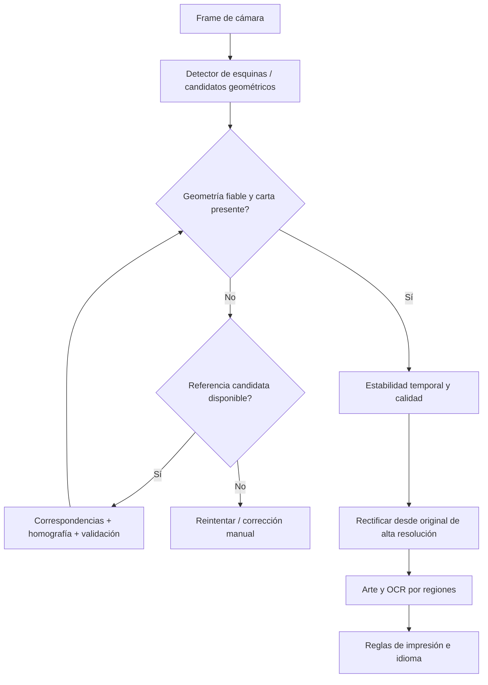

# Investigación de bordes tras fallo v18 — 2026-09-25

## Evidencia real

Sony verificadoQV770HG2JD. Descargados30JSONv18 ylosoriginales/rectificados disponibles a build/boundary-v18-live-review(privado).28AUTO_OUTER_EXPERIMENT,2USER_FIXED_SESSION;10identidadesúnicas,1ambigua,19vacías. Son lecturas retenidas, no estimación de precisión general ni benchmarkcontraManaBox.

Feral1790341502047 originalmuestra cartaen soporte blanco con otrascartas debajo. Quadempiezaenelsoporteencimadelacarta yterminaantesdelpie: rectificaciónincluyefondo ycortacontenidoaunqueoriginalcontienecartacompleta. No es resolucióndelOCR ni solamente marcointerior. Crecimiento de contornosv18nohasolucionadoselecciónobjeto.

Dosfijas1790341411572y1790341428030 tienenquad distinto. No hay IDcalibración/motivo invalidación ni zoom/rotaciónregistrados para atribuircausa. Código leezoomCamera.zoomState alconfirmarcorrección despuésunbindAll: posiblevalortransitorio/fallback1 yposteriorinvalidaciónalrebind. Hipótesispendiente reproducir, no declarararreglado. Laspruebasanterioresno cubríanrepeticióncompleta capturar→corregir→analizar→reenlazar.

## Qué sabemos de ManaBox

Guíaoficial: fondo liso contrastado, iluminaciónsinsombras/reflejos, evitarsuperposiciones. Identificaporarte; mismailustraciónenvariasversionespuederequerirselecciónmanual. Modo rápido eligeprimeraversióncoincidente. No documentaalgoritmointernodebordes; no afirmarusaYOLO/ORB/pHash/modeloespecífico.

- https://manabox.app/guides/es/scanner/getting-started/
- https://manabox.app/guides/es/scanner/faq/

Separarmétricascomparativas: encontrarlacarta/fluidez vsresolverimpresiónexacta/idioma. ParidadManaBox requierepruebasmismoteléfono,mismascondiciones,objetivos separados; no prometerporcentaje.

## Alternativas investigadas (no ejecutadas todavía sobreelcorpus)

| Enfoque | Ventaja | Límite / decisión |
|---|---|---|
| OpenCV geométrico mejorado, líneas Hough + evidencia fondo/interior | Reutiliza actual, referenciaoffline sin entrenar | El soporte/otrascartas tienenlíneasfuertes. Mantenerbaseline, no continuarparchesdeáreamayorcomoestrategiaprincipal |
| DocAligner DocsaidLab: predicción4esquinas, ONNX | Prototipooffline accesible, modeloenfocadoadocumentos | No confundir conotroDocAligner académico de anotación. DebevalidarseMagic,fundas,bordesnegros,ausenciacarta; licenciarepositorioApache2peroauditarpesos/dependenciasantesredistribuir |
| LDRNet: clasificacióndocumento+líneas+esquinas | Referenciaarquitectónica móviles másdirecta que contornos | Paper no equivaleSDKlistoparausar. Verificarcódigo/pesosdisponibles ymedirSonyantesintegrar |
| ML Kit Document Scanner | FlujoAndroidcompleto detección/recorte | APIpresentaflujodeUIpropio, no sustituto directo del analizadorCameraXcontinuo. No primer candidato para nuestroflujo |

Fuentesprimarias:
- https://github.com/DocsaidLab/DocAligner
- https://docsaid.org/en/docs/docaligner/intro/
- https://arxiv.org/abs/2206.02136
- https://arxiv.org/abs/2106.09987
- https://developers.google.com/ml-kit/vision/doc-scanner/android
- https://docs.opencv.org/4.12.0/dd/d1a/group__imgproc__feature.html

## Recomendación

### Ampliación de investigación: 25/09/2026

La comparación DocAligner ya se realizó; resultados en `DOCALIGNER_COMPARISON.md`.
No justifica sustituir OpenCV directamente. Las alternativas siguientes solo se han
investigado, NO se han ejecutado sobre nuestras fotos ni medido en el Sony.

| Alternativa | Encaje | Limitación / próximo experimento |
| --- | --- | --- |
| CollectorVision | Proyecto específico de cartas, MTG como catálogo principal; expone NeuralCornerDetector con ONNX Runtime separado del reconocimiento | Comparar solo sus esquinas con nuestras capturas. README declara AGPL-3.0 y opción comercial: revisar código, pesos y condiciones antes de integrar. No asumir que Python/ONNX equivale a integración Android lista. |
| Correspondencias locales + homografía OpenCV | Usa puntos visuales de una referencia para proyectar su contorno en la cámara, aunque el borde contraste poco | Probar tras generar pocos candidatos por arte/OCR. Requiere suficientes correspondencias distribuidas, RANSAC y rechazo de transformaciones degeneradas. Arte compartido y layouts distintos impiden inferir edición o borde de forma automática sin validar. |
| Vuforia Image Targets | Localiza y sigue imágenes conocidas mediante características naturales | Requiere referencias; recomienda hasta 1000 objetivos por base local (no límite absoluto). No es detector genérico de cuatro esquinas de una carta desconocida. Antes de integrar, comprobar licencia y convivencia con CameraX. |
| Marcadores ArUco en soporte | Estiman la geometría de un soporte con marcas impresas; interesante para lotes colocados siempre en un hueco | Propuesta propia basada en API OpenCV. Requiere relación fija carta/marcadores y plano compatible. Detecta el soporte, no garantiza presencia ni posición de una carta libre. |
| Red de esquinas + líneas / segmentación específica | Puede distinguir carta de soporte mejor que elegir rectángulos por contraste | Entrenamiento/adaptación y datos reales si el modelo disponible no generaliza; no basta una caja rectangular alineada a la imagen para corregir perspectiva. |

Fuentes primarias:
- [CollectorVision, API y licencia declarada](https://github.com/HanClinto/CollectorVision)
- [Implementación de esquinas](https://github.com/HanClinto/CollectorVision/blob/main/collector_vision/detectors/neural.py)
- [OpenCV: correspondencias y homografía](https://docs.opencv.org/4.x/d1/de0/tutorial_py_feature_homography.html)
- [Vuforia Image Targets](https://developer.vuforia.com/library/vuforia-engine/images-and-objects/image-targets/image-targets/)
- [Vuforia bases locales](https://developer.vuforia.com/library/vuforia-engine/images-and-objects/image-targets/device-databases/device-databases/)
- [OpenCV ArUco](https://docs.opencv.org/4.x/d5/dae/tutorial_aruco_detection.html)
- [LDRNet: predicción conjunta de esquinas, líneas y clasificación](https://arxiv.org/abs/2206.02136)
- [Magic Card Detector, explicación del autor](https://tmikonen.github.io/quantitatively/2020-01-01-magic-card-detector/): contornos, cuadriláteros envolventes y pHash; documenta fallos con superposición y sensibilidad al recorte. No constituye evidencia de mejora sobre nuestra implementación.

Orden recomendado actualizado:
1. Anotar borde físico en originales, separar por escena/carta y reservar casos no usados para ajuste. Las 30 capturas actuales son exploratorias y correlacionadas; añadir negativos, desenfoque, reflejos, dedos y recortes parciales.
2. Comparar CollectorVision sin modificar APK: error de esquinas normalizado, pie/título cortados, fondo añadido, rechazos y falsos positivos. No contar devolver cuatro puntos como acierto.
3. Evaluar homografía como rescate sobre candidatos, separando el caso ideal con referencia conocida del flujo real que primero debe encontrarla. No ejecutar OCR completo para cada contorno.
4. Solo con mejora real, integrar bajo flag y medir p50/p95, memoria, calentamiento y estabilidad temporal en Sony. Inferir geometría en imagen reducida; rectificar OCR desde original de mayor resolución conservando transformaciones.
5. Mantener reparación del modo fijo pendiente e independiente: congelar geometría/contexto de cámara activo y validar varios ciclos reales. El seguimiento temporal requiere reset al retirar/cambiar carta; suavizar un borde incorrecto no lo corrige.

El bucle de rescate debe tener presupuesto acotado; no bloquear cámara ni perpetuar
una referencia de la carta anterior. Ubicación y reconocimiento de edición son
problemas diferentes. Subir resolución no corrige por sí solo seleccionar el marco interior.

### Recomendación anterior (histórica; DocAligner ya evaluado)

1. Arreglarfijoaisladamente. Modelareferencia(sessionId,calibrationId,quad,zoomconfirmadoENFRAMEACTIVO,rotación,resolución,cámara). Congelarla salvoacciónexplícitaocambioefectivoconfirmado; logmotivoantesinvalidar. No leerparámetrosde unacámaraapagada para crearcalibración. Probarvariosciclosreales ycompararquadidéntico;overlayfijoigualrectificación. No ocultarealinvalidación,mostrarrecalibración.
2. Etiquetar4esquinasfísicas enlos30originalesysepararparciales/oclusiones. Nocambiarmodelo evaluandotodoslosframescorrelacionadoscomo independientes;reservarescenas/cartasfueraajuste.
3. ProbarDocAlignerlocalmente contraOpenCVbaseline. No subirfotosprivadasademoweb. Descargar/validarmodeloaislado,documentarlicenciahashyversión; aúnnohacerconversión/integraciónAPK.
4. Si mejora, pipelinehíbrido: localización4esquinas/presencia→refinadoconlíneaslocalesrespaldadas→validacióngeometría→trackingtemporal→rectificación→hashrápido→OCRsoloambigüedades. Tracking no debepropagar bordeincorrecto ni usarartecartaanterior.
5. Medirerrornormalizadodeesquinas,bordecortado/fondoincluido,fallosenblanco/soporte,tiempop50/p95 yretenciones/rechazos. Objetivoprincipalnohacercroperróneodealtaconfianza. Velocidadespublicadasdeotrosdispositivosnoextrapolables.
6. ComparaciónmanualManaBox Sony conlasmismascartas; contaridentificaciónyseleccióndeediciónporseparado.

No códigoAndroid cambiado ni nuevaAPK instaladaenestainvestigación. V18continúainstalada. Próximopaso recomendado: correcciónfijoconregresiónend-to-end yprototipoofflineaprendidoconcorpusetiquetado, antesdepedirotro lotea ciegas.
