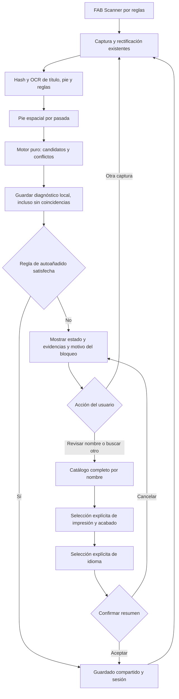

# Scanner por reglas — primera entrega y autoañadido por arte único

Fecha: 23/09/2026. Rama: `codex/rules-scanner`.

Base: `feature/improbe-hash-scanner` (`a06c745`) **más su estado de trabajo actual**, copiado sin modificar el original. No se han creado commits. El manifiesto local `build/inherited-working-state.json` distingue los archivos heredados de esta entrega.

Especificación completa: [MAGIC_CARD_IDENTIFICATION_RULES.md](MAGIC_CARD_IDENTIFICATION_RULES.md).

## Estado actual resumido — v16 (2026-09-25)

Esta tabla prevalece sobre las notas históricas de entregas anteriores. No están implementadas todas las reglas del documento original.

| Bloque | Estado real |
|---|---|
| Captura, rectificación, zoom persistente, reintentos y diagnóstico | Implementado; calidad/oclusión no resueltas de forma general |
| Arte + título OCR/diccionario | Implementado; arte fuerte no demuestra edición |
| Idioma por título exacto, reglas y pie | Implementado con conflictos; selector manual por impresión |
| Pie moderno: código, número e idioma | Implementado con coherencia espacial y corroboración |
| Pie histórico: copyright, artista, número y total independientes | Extracción implementada; fiabilidad óptica variable |
| Comparación histórica con catálogo | Año orientativo, artista exacto y número; solo revisión, no resolución automática general |
| Diccionario de artistas | v16: normalización global conservadora, trazable y corroborada |
| Autoañadido | Casos acotados de arte único/pie moderno; no todas las cartas históricas |
| Total impreso de referencia y perfiles históricos | Pendiente; no sustituir denominador por tamaño del catálogo |
| Símbolo y firmas visuales por región | No integrados como prueba general en reglas; existe trabajo reutilizable en laboratorio hash |
| Bordes, layout y excepciones antiguas/promos/reimpresiones | Parcial: guardas presentes, identificación general pendiente |
| Acabado físico foil/etched | Pendiente detección; selección usuario no es observación óptica |
| Catálogo global y métricas de falsa aceptación | Pendiente ampliar cobertura y corpus etiquetado |

### Investigación aplazada por petición del usuario

- Firmas visuales por regiones, descriptores locales y otros reconocedores de imagen.
- Evaluar Vuforia como candidato, sin asumir que resuelve impresiones visualmente idénticas; comprobar integración Android, licencia, offline, tamaño del índice y consumo.
- Evaluar motores OCR nativos C++ y ejecución CPU/GPU. No asumir que cambiar lenguaje o usar GPU mejora latencia; medir transferencia, inicialización, precisión del texto pequeño y consumo en Sony.
- OCR por etapas/región para evitar ejecutar siempre todas las variantes.
- Mantener índice de arte actual; no regenerar masivamente pHash ni migrar motor durante esta tarea.
- Cartas antiguas sin año siguen aplazadas.

## Alcance real

Primer incremento de las fases 0/1, no implementación de las 66 reglas ni cierre completo de esas fases. El nuevo FAB (esquinas con un check, a la izquierda del FAB hash) abre `RulesScanActivity`. Los scanners anteriores siguen disponibles.

- Reutiliza CameraX, OpenCV, estabilidad, captura, rectificación, índices hash, OCR, sesión, copias, deshacer y guardado Room + legacy de `RapidEditionScanActivity`.
- No lee/escribe las preferencias `hash_scanner`. Control propio `auto_unique_art` en `rules_scanner`, activo por defecto: autoañadido por inferencia de catálogo de arte único. No usa edición probable ni retenida del scanner hash.
- Conserva cajas OCR normalizadas, texto y pasada de preprocesado. Solo asocia número y `SET IDIOMA` en la **misma pasada**, próximos y alineados en el pie. No mezcla variantes de contraste para inventar tuplas.
- Motor puro con estados `NO_MATCH`, `IDENTITY_ONLY`, `PRINTING_CANDIDATE`, `CONFLICT` y reglas de seguridad trazables. La decisión de evidencia es independiente de `RulesAutoAddPolicy`, que autoriza o bloquea el guardado.
- No confunde pie ilegible con ausencia observada. No deduce idioma del nombre, del set ni del fallback inglés. El idioma de reglas requiere ≥20 letras y confianza ≥0,80; son umbrales iniciales **no calibrados**.
- El borde se registra, pero todavía no excluye impresiones. El símbolo no se analiza en esta primera entrega.
- Los casos no aptos para autoañadido pasan a revisión. La búsqueda manual usa el catálogo compartido completo por nombre, fuera del top-K del hash. La lista permite seleccionar impresión **y acabado**; después se elige el idioma físico y se confirma el resumen. No preselecciona un idioma como si hubiese sido reconocido.
- El guardado sigue `addSelectedEdition`; no hay un segundo almacén de colección. La selección manual queda marcada `USER_CONFIRMED`; la automática `AUTO_CATALOG_UNIQUE_ARTWORK`, separadas de las observaciones.

## Flujo implementado

## Evidencias y límites

`files/rules_scan/` dentro del almacenamiento privado de la app conserva como máximo **30 intentos** (JPEG rectificado y JSON), incluidos los no reconocidos. No se envían estas capturas a servicios OCR remotos ni se añade una subida cloud. La app ya tiene `allowBackup=false`. Las evidencias asociadas a cartas guardadas siguen el almacenamiento existente, independiente de ese límite de 30.

Cada intento lleva `scanId`, `policyVersion=rules-unique-art-2`, rama, nombres de assets, candidatos con distancias, UUID, textos/cajas/pasadas OCR, idioma observado, estado, reglas y errores. La evidencia guardada con una carta añade la selección manual y comparte el `scanId` del intento.

La cobertura declarada es **`ART_INDEX_ONLY`**, incluso si solo queda un UUID. La revisión de catálogo es `UNVERSIONED_ASSET`: aún faltan el manifiesto/versionado del dataset y cobertura global verificable. Las reglas listadas incluyen guardas activas (D02/F01/P10); no significan que se haya detectado físicamente una reimpresión o un acabado.

Limitaciones pendientes:

1. Corpus etiquetado real por impresión/idioma/acabado y métricas de falsa aceptación. No interpretar pruebas unitarias como precisión óptica medida.
2. Calidad por ROI (nitidez/reflejos), clasificación de layout, orientación/cara y perfiles modernos ampliados. De momento solo se interpreta conservadoramente el pie inferior izquierdo; texto fusionado con artista u otro layout puede quedar ilegible.
3. Lookup automático global por set+número independiente del arte; márgenes hash calibrados, calidad/confianza del nombre y ranking entre identidades. Actualmente hay búsqueda **manual** fuera del top-K, no resolución automática global.
4. Catálogo ampliado con marcas de reimpresión, The List/Mystery Booster, promos, tratamientos, símbolos, copyright, familias antiguas y excepciones regionales.
5. Acabados foil/etched mediante evidencia temporal y dispositivo real. La lista del catálogo enumera posibilidades, no mide el acabado de la carta.
6. Automatización general pendiente. La excepción actual por arte único es inferencia local de catálogo, corregible, no una prueba de cobertura global. Los umbrales necesitan calibración con un corpus mayor.

## Pruebas y cómo probar

- Pruebas JVM nuevas: `StructuredPrintingEvidenceTest` (13) y `RulesScanPolicyTest` (12). Tuplas coherentes, no mezcla entre pasadas, texto fuera de ROI, sufijos/números, conflictos, fallback de idioma, cobertura parcial y prohibición de autoañadir.
- Pruebas Android: `RulesScannerDeviceTest`: Activity independiente, preferencias antiguas intactas, FAB en 320dp, Activity no exportada, pipeline sobre imagen vacía y diagnóstico sin autoañadido; cancelación, confirmación única y callbacks obsoletos sin guardar colección.
- Compilar desde Windows con Java 17: `gradlew.bat :app:testDebugUnitTest :app:assembleDebug :app:assembleDebugAndroidTest --console=plain`.
- Verificar manualmente una carta moderna con pie, dos reimpresiones con el mismo arte, una carta antigua sin código, ES/PT con título compartido y foil/no foil. Revisar que solo se autoañadan las que superen todas las guardas; desmarcar el nuevo control para forzar revisión.
- Cancelar selector de edición/idioma/confirmación, pulsar otra captura, volver atrás, abrir sesión y probar copias/deshacer. No deberían cambiar cantidades al cancelar.
- La splash usa `BuildConfig.GIT_BRANCH` y debe mostrar `codex/rules-scanner`.

No desinstalar ni borrar datos para instalar esta APK; usar actualización `install -r` solo tras verificar dispositivo y compilación terminada.

### Validación inicial (histórico; superada por el incremento siguiente)

- `BUILD SUCCESSFUL`: APK debug y APK de pruebas compiladas con Java 17.
- 279 pruebas JVM: 0 fallos, 0 errores, 0 omitidas (25 pruebas nuevas).
- `git diff --check` sin errores; rama generada en splash verificada.
- Las 4 pruebas Android nuevas están compiladas, **aún no ejecutadas**. Prueba visual/cámara y lectura de cartas reales pendientes.
- Actualizada en Sony XQ-DQ54 `QV770HG2JD` mediante `install -r`: Success, sin borrar datos. SHA256 instalado igual al APK: `e39b4f9161a7f7904c72cd7933ecd2ed478072e125a89a963578e51cdc724de4`.
- Verificados en la UI los cuatro FAB y que el nuevo abre `RulesScanActivity`. Se regresó a la Biblio.
- La instalación del APK de pruebas falló con `INSTALL_FAILED_UPDATE_INCOMPATIBLE` para el paquete **de tests** (firma diferente); no se desinstaló ni se borró nada. Las pruebas instrumentales siguen pendientes; la aplicación principal sí se actualizó correctamente.

## Incremento: artes únicos SOA #52 y SPG #150

Las capturas reales mostraron coincidencias hash fuertes (Giant Growth p6/d6, Archmage Emeritus p4/d10). Los seis registros por arte son idiomas: un único set y UUID. El bloqueo original era la revisión obligatoria, no falta de reconocimiento por hash.

`RulesAutoAddPolicy` permite autoañadir únicamente cuando:

1. El control propio está activo, hay foto y no hay errores de análisis.
2. Top1 tiene illustrationId, pHash≤10/dHash≤16 y margen de al menos 4 bits pHash frente a cualquier otro arte devuelto. Sin competidor para medir margen, bloquea.
3. Si OCR propone identidades, todas coinciden con el arte; OCR por sí solo nunca rescata un hash débil.
4. Todas las variantes del arte tienen un único set y UUID **antes** de filtrar idioma/acabado; fuera de los sets históricos excluidos y sin reversos no soportados. APV1 usa face255 para cartas normales y face0 para frontal explícita.
5. El pie estructurado no contradice set/número, el idioma es observado con confianza y existe su fila exacta en el índice. No cae a inglés.
6. El acabado preferido está disponible. Se reutiliza `scanner_preferences.scan_foil` del checkFoil de la sesión: no se duplica el control ni se presenta como acabado detectado. El texto del control muestra nonfoil/foil.

Si falla una guarda, permanece el panel manual con el motivo `WEAK_ART`, `ART_MARGIN`, `MULTIPLE_SETS`, etc. La captura SOA mal rectificada que devolvía Fiery Justice p12/d30 sigue bloqueada. No se han relajado parsers de pie para inventar SOA/SPG a partir de texto fusionado con el artista.

Las evidencias incluyen razón, UUID propuesto y `finishProvenance=SCANNER_PREFERENCE`; `finishState=UNREADABLE` permanece correcto. El guardado automático reutiliza copias/sesión/Room/legacy y permite corregir/deshacer.

Pruebas nuevas: `RulesAutoAddPolicyTest` (16 JVM, incluidas ambas cartas en el asset real) y replay instrumental de las dos fotos privadas mediante `RulesScannerDeviceTest`, sin escribir colección. Los tests UI desactivan temporalmente solo la preferencia propia y la restauran al terminar para evitar autoañadir cartas delante de la cámara durante pruebas.

Para no desinstalar el paquete de tests anterior con firma incompatible, se usa un applicationId **solo de pruebas** separado, `io.asv.mtgocr.ocrreader.rules.test`, mediante init script local ignorado `build/rules-test-id.gradle`. No cambia el applicationId ni firma de la app principal.

### Validación del incremento de autoañadido

- `BUILD SUCCESSFUL` con Java17: 295 JVM, 0 fallos/errores/omitidas.
- Sony XQ-DQ54 `QV770HG2JD`: **17 instrumentales OK (15,302s)**, incluyendo replay real SOA/SPG, UI de reglas, cancelación/doble confirmación, selector de sesión, panel de copias y detalle de evidencias. No se escribió la colección para simular escaneos.
- App actualizada-r Success sin borrar datos. SHA256 APK/instalada idéntico: `6f8c7c9762cdf0e5bf662122f59c123058acab3d993f1a1c8800b529aa59eb7f`.
- Preferencia propia restaurada sin entrada `auto_unique_art`: aplica su valor inicial `true`. CheckFoil de la sesión no modificado.
- `git diff --check` correcto. Worktree de origen intacto según sus65rutas del snapshot.
- Pendiente repetir la captura live de las cartas con esta versión; el replay comprobó reconocimiento y elegibilidad de autoañadido sin insertar copias de prueba.

## Incremento: pie moderno y arte compartido (`rules-modern-footer-3`)

- Nuevos elementos OCR con cajas por palabra, ligados a línea y pasada. Se separa `SET IDIOMA` del artista únicamente en límites de palabras reales; no se parte `SOASP` por intuición ni se repara `MO150` a `M0150` automáticamente.
- Rareza pegada (`U0052`), ceros iniciales equivalentes y fracciones soportados. No truncar dígitos/sufijos repartidos entre tokens. Conflictos entre lecturas siguen siendo conflictos.
- Tupla completa corroborada entre dos familias de ROI (ancha, enfocada, completa), no solo tres contrastes del mismo recorte. Sigue siendo una única foto, no evidencia independiente.
- Nueva ruta `STRUCTURED_FOOTER`/`AUTO_STRUCTURED_FOOTER` permite distinguir impresiones del mismo arte por set+número. Reutiliza el resto de guardas de identidad, idioma, acabado, persistencia y copias.
- Antes de filtrar, bloquear posibles pies heredados (`PLST`, `MB1`, `FMB1`, `MB2`, tipo promo). Si el grupo contiene tipos desconocidos/no soportados, revisión: no eliminar esas alternativas ciegamente. Por ahora solo tipos core/expansion/masters/draft_innovation.
- Se añaden al JSON cajas de elementos, pasadas de tupla completa, corroboración y tipos de set utilizados. La ruta de arte exclusivo validada en vivo se conserva.
- Casos y orden de pruebas: **[RULES_SCANNER_TEST_PLAN.md](RULES_SCANNER_TEST_PLAN.md)**. Próximo bloque de implementación: símbolos; marcas/reimpresiones y antiguas después.
- Validación:314JVM0fallos;19AndroidOK15,719s; BUILD SUCCESSFUL y diffcheck. Replay real SOA/SPG conserva autoañadido. OCR sintético moderno pasa; catálogo real MindRot distingue M19/M20/M21 con tuplas de prueba. Falta validar ópticamente esas cartas físicas.
- App y tests actualizados-r en Sony sin borrar datos; SHA256 app `9a0303c2dca6a15ea712428511204841a508f0e6eef7e19e2bd1aea59de09451`. Tests siguen en paquete separado `.rules.test`.

## Incremento OCR (`rules-ocr-quality-4`, 2026-09-24)

- Corrección contextual de O→0 y I/l/|→1 únicamente en la línea numérica alineada del pie, exigiendo algún dígito real; se conservan sufijos válidos y texto OCR original. No se corrigen códigos de set por similitud.
- Diccionario exacto de códigos+idiomas: `ORIEN` se segmenta solo si existe una única descomposición válida; admite separadores OCR `:` y `-`. Los nombres ya usan `CardRepository.matchLocalPhotoText`/`nameResolver.resolveLocalOcrLines`, sin duplicar índices ni consultas de red.
- CLAHE OCR local en título y pie. Pie: variantes originales conservadas y recorte estrecho adicional para separar artista. Pasadas7/8 pertenecen a familias0/1;9/10 a familia3. Más contrastes no equivalen a más votos independientes.
- Rules solicita CameraX1600×1200 y rectifica945×1320; la resolución efectiva depende del dispositivo. Hash recibe630×880 sin CLAHE. Los otros modos conservan configuración previa. Pendiente verificar encuadre/resolución efectiva/nitidez en vivo.
- OCR original: ajuste `OCR experimental: CLAHE y mayor resolución`, apagado por defecto. OFF conserva método y solicitud1280×1024 previos; ON solicita1600×1280 y reemplaza solo tratamiento del título por CLAHE. Máscara, texto de reglas, crominancia y resolución de nombres permanecen. Si OpenCV no está disponible vuelve al tratamiento anterior.
- Diagnóstico de nitidez por título/pie con Laplaciano normalizado; no se aplica un umbral sin calibrar. `occlusionState=UNASSESSED`: NO hay detector fiable de dedos/oclusiones añadido. Ni una imagen nítida prueba que esté completa ni una parcial implica desenfoque.
- Replay Hada: ambas fotos danORI57/en; goodcorrobora6/8/9; badsolo0/7, mantiene revisión. Footer mejorado2106/1873ms frente1428/1290ms antiguo ejecutado después y caliente: coste aproximado+0,6s, no comparación controlada ni tiempo total de cámara.
- Validación final:315JVM sin fallos;9AndroidOK23,724s (replayHada,SOA/SPG,reglas y máscara legacy en4rotaciones). APK instalada-rSony sin borrar datos. SHA256 `4e5a456a4cac3e7639394a0f0332aa1dc0a2e75409a9081640b9f9efa1449e0d`.
- Pendiente: A/B físico de blancas antiguas, latencia de cámara conflag, calibración de nitidez y capturasparciales, recuperación de borrosas sin reducir guardas. Símbolos quedan pospuestos.

## Revisión de capturas y controles (`rules-footer-profiles-5`)

- Corpus privado `build/rules-review-latest`:30intentosquality4;12READ/18UNREADABLE. HadaORI57:3/3STRUCTURED_FOOTER. ParagonM15#190,GargoyleM15#216,SOA52,SPG150 leen datos; no siempre autoañaden por las guardas de arte.
- Muchas UNREADABLE son ArcboundWorker/Frogmite/Thoughtcast/VaultSkirge con pies antiguos SIN código moderno SET+idioma. OCR sí ve artista/copyright/fracción; no basta aumentar resolución. Frogmite mezcla202/229y207/229 entre pasadas. No escoger una edición ignorando alternativas/reimpresiones.
- Se añade evidencia histórica PARTIAL(number,total,year) cuando se leen año y fracción en banda inferior. No inventa set ni idioma, no habilita autoañadido, no repara fracciones sin barra; si no hay evidencia suficiente permaneceUNREADABLE. Panel yJSON explican pie parcial. Siguiente bloque: perfiles anteriores aM15 y contraste con símbolo/catálogo/marcas.
- Código+idioma concatenados se resuelven para TODOS los códigos conocidos con separación única exacta; no soloORI. Ahora también acepta el punto deOCR (`M15.SP`). No se acepta artista pegado sin límites verificables.
- Check experimental se mueve desdeAjustes a pantallaOCRoriginal (`scanActions`), conservando el valor guardado. Solo controla eseOCR; reglas mantiene su procesamiento propio.
- Zoom variable con sliderCameraX enRapid/Hash/Rules,solo cámara trasera existente. Durante gesto y600ms después se pausa análisis; se reinicianestabilidad/quad enexecutor cámara, no desdeUI. No se cambian lentes explícitamente. ElOCRoriginal ya disponía de gesto de pinza.
- Selector de ediciones compartido usa `deliverEditionsBeforePrices=true` tanto en grid como lista: muestraRoom antes de esperarprecios/red cuando está disponible; conserva resultados locales ante error posterior. Fuentes:cachememoria+Room; descubrimientoScryfall/MTGJSON si falta/caduca yprecios/imágenes pueden usarred. No afirmar que es siempreoffline o que ya se midió la mejora de latencia en frío.
- Validación317JVM0fallos,22AndroidOK24.985s,BUILD SUCCESSFUL,diffcheck. App+tests instaladas-rSonyQV770HG2JDsinborrar. SHA256a85df6d106db6a6b2879cd1a61550b2b37462368249dd977a364f68afb9f5b48.

## Reintentos y zoom persistente (`rules-retry-zoom-6`)

- El zoom se guarda como ratio porActivity/cámara trasera en `camera_zoom`, solo al mover el slider. Cada bind lo restaura dentro del rango admitido, sin sobrescribir la preferencia con el1x inicial deCameraX. Se elimina elobservador anterior y unageneración descarta callbacks viejos. Capturaesperarestauración+600ms. Incluye reapertura tras resultado y recreacióndeActivity.
- Rules: hasta3capturas nuevas en modo live+auto para fallos recuperables (arte/pie/idioma/conflicto). Éxitoautoañade inmediatamente; tras3sinresolver muestra la última captura para revisión. No fusiona evidencias entre fotogramas ni conservaunaediciónpararellenarotra. Intentoactual enUI/JSON.
- Manual,autoOFF yambigüedadesestructurales (PLST/promos,perfilnoadmitido,histórica) pasanarevisiónsinrepetir inútilmente. Elcontador solo sobrevive alretornoautomático; se reinicia enretornomanual,pausa,éxito/revisión.
- OCRoriginal,CLAHE,resolución yreglasdeaceptación no modificados por esteincremento.

- Restauraciónzoom probadaenSony:CameraXpuede emitirOPENantesdequeelcontrolestéactivo;se verificazoomefectivo200msdespués yreintentanrequestscanceladashasta4vecesmáscongeneración/lifecycle. Testexigenuevobindyrestauraciónterminada;2retornoscámara+recreaciónActivitymantienen1.7x(límitedispositivoaplicado).
- Validaciónfinal:320JVM0fallos/errores/skips;23AndroidOK24.409s;BUILD SUCCESSFUL,diffcheck. Appytests instaladas-rSonyQV770HG2JDsinborrados. SHA256 `87dc29012ad05a4e7efd3ac00c0ca377388a297359126baa4fc1bc44db34eb29`. Logs `build/rules-retry-build.log`, `build/rules-retry-device.log`, testzoomaislado `build/rules-zoom-device.log`.
- Pendientepruebaenmanodelaráfaga conpieenfocable ydeubicacióndecontroles; pruebaspolítica/controlnoreemplazancorpusfísico. OCRoriginalsin cambios.

## Campos históricos independientes (`rules-historical-fields-7`)

- `HistoricalFooterEvidence`: copyright/años (incluye rangos), artista y fracción con estados propios y procedencia OCR (pasada/caja/texto). Reparación contextual O→0/I,l,|→1 en números; no transforma nombres ni códigos. Artista explícitamente etiquetado puede sobrevivir sin copyright; nombre sin etiqueta necesita línea copyright adyacente de la misma pasada. Mantiene hipótesis contradictorias, no vota entre filtros.
- La falta de un campo ya no borra los otros: resultado PARTIAL, no edición inventada. Revisión muestra año primero; JSON `historicalFooter` conserva cada observación. Reglas modernas y autoañadido no relajadas; perfiles históricos aún no filtran catálogo. Sin cambios al OCR original, cámara, resolución ni número de pasadas (11rules).
- Reprocesado corpus privado30capturas:20contienen alguna evidencia parcial (no equivale a20ediciones resueltas). Replay JPEG real Pacifismo1996 y Atraer2013 recupera año/artista. Persisten variantes erróneas del artista, mostradas como hipótesis/CONFLICT; número sigue generalmente ilegible. Siguiente paso ROI histórico y después cruce catálogo/símbolo.
- Validación final: {'tests': 328, 'failures': 0, 'errors': 0, 'skipped': 0}; Android25OK26.01s, incluye2pruebas históricas (30JSON y2JPEG), regresionesSOA/SPG/Hada, zoom, sesión/copias/evidencias y OCR original. `build/historical-fields-build.log`, `build/historical-fields-device.log`. Instalada-r SonyQV770HG2JD sin borrar datos. SHA256 `404a3e4c8486828f6393ecb7fa134627e66412f18877e5b0d94b146601e35d14`.
- Incidencia del arnés: envío binario por stdin a adb shell truncó JPEG a535bytes; corregido mediante adb push temporal, copia run-as y comparación byte a byte. Fallo de fixture, no del OCR; suite completa repetida correctamente. Metadatos privados quedan fueraGit.
- Hashes: auditados scripts yAndroid; no regenerados. Ver propuesta A/B en ART_HASH_EVALUATION.md y prueba manual en RULES_SCANNER_TEST_PLAN.md.

## Interpretación de formatos (`rules-historical-formats-8`)

- Año terminal compatible con un único rango explícito (1993–2007 y2007): READ manteniendo valores yprocedencia. Años distintos/rangos distintos permanecenCONFLICT; sin votación entre filtros.
- Artista a derecha se admite en banda>=.92, adyacente acopyright de misma pasada ysolapamiento horizontal. ReplaySpinintoMyth recuperaDavidDay. El glyph©real se separa de artista; letrasO/Cambiguas no se borran para no mutilar nombres.
- No cambiaOCR original, cámara, hashes, número de pasadas ni autoañadido; cartas sin año ycolocaciónAbejas pospuestas por usuario. Sin nuevoscrucesconcatálogo todavía.
- 333JVM0fallos/errores/skips y26AndroidOK27.013s; replay60JSON (doscorpus30),2JPEGanteriores yregresionesmodernas/cámara/sesión. ReplayV7 verificaDavidDay, rangos2007/2003sinconflicto yconflicto17/301vs17/501 conservado. BUILD SUCCESSFUL ydiffcheck. App+tests instaladas-r SonyQV770HG2JD conservandodatos.
- SHA256 `fbccb496c7b94998174da6ed402ba5c92a0b48ee699fc78c7c2edf3a1e91bade`; logs `build/historical-formats-build.log`, `build/historical-formats-device.log`; informeprivado `build/historical-review-v7/replay-v8.txt`. Pruebasmanuales en RULES_SCANNER_TEST_PLAN.md.

## Tabla de evidencias (UI sobre política formats-8)

- Sustituye ayuda fija Arte fuerte ybloques de texto por Dato/Valor/Estado inmediatamente después del título de resultado en elcontenedor de revisión. RulesScanEvidenceTable muestra nombreOCR,artecandidato,año,artista,fracción,númeromoderno,códigoedición,idioma.
- ✅Leído sinconflicto no significa verdadfísica/impresiónconfirmada;⚠️Parcial/Conflicto;❌Sin lectura no equivaleaausente. Arte se etiqueta candidato, noverde. RecursosdebugES, tabla enscroll existente, detalleJSONenEvidencias. Sin cambiospolíticaOCR/auto/cámara.
- {'tests': 333, 'failures': 0, 'errors': 0, 'skipped': 0};27AndroidOK25.932s. TestUI render320dp confirma estados/textos, ausenciaayudafija ysin escriturascolección; preview inspeccionada `build/rules-table-preview.png`. Compilación/diffcheck correctos; instalada-rapp+testsSonyQV770HG2JD sinborrar.
- SHA256 `8f8c485adf0a20070d186415803ae0e0ee23393715527e1a5c522c0f40356893`. Logs `build/rules-table-build.log`, `build/rules-table-device.log`. Pendientevalidaciónmanualdeubicación/scroll real con diferentes tamaños de fuente.

## Arte real en tabla y fallback de título (`rules-art-title-9`)

- Diagnóstico30capturas `build/rules-table-review`: arte siemprePARTIAL era etiquetaUIconstante; no estado real. TitanicBulvox4/4,FlickeringSpirit4/9,Farrelite8/2 muestranbuenhash; Sarcomite/Spin tienen variosp14/candidatosincorrectos. OCRsinerrors ybarrieresperatodaslasetapas; nohaytimeoutqueabortelectura.
- `RulesArtworkEvidence` comparteguardas existentesAutoAdd/UI:identificador,p<=10,d<=16,competidor distinto,margenp>=4,sincontradicciónOCR. Tabla✅Fuerte,⚠Débil,⚠Sinmargen,⚠Conflicto; no confirmaedición. Umbralesautoidénticos.
- Títuloreadperonoidentificadoahoramuestraraw+⚠Sinresolver. `matchLocalPhotoText(fullTitleDictionary=true)` soloenrules, fallbacksi rutarápida vacía:índicelocalcompleto,pormismalínea/variante,no concatenar alternativas, no filtrarporarte, no ampliar tolerancias. @JvmOverloadsconservaJava;otroscallerspordefectosin cambios. Entradavacíanopreparaíndice.
- Replay30JSON:FarrelitePriest3/3recuperados;BenalishHero0/3pendienteOCRdeformado;resultadosrápidosconservados. Fullresolverdirectocoldcargaimplementación~7s enprueba;appya preparadictionarioantesdecámara. FallbackwarmdifícilFarrelite~1s adicional enprimerreplay, noañadidaspasadasdeimagen. Noasegurarlatenciaend-to-endigual;probarfísicamente.
- JSONañadeartReadReason,titleReadState,ocrElapsedMs. 337JVM0fallos/errores/skips;28AndroidOK40.031s; UIrender320dpcon✅Fuerteinspeccionado. Logsbuild/rules-art-title-build.log,build/rules-art-title-device.log;BUILD SUCCESSFUL,diffcheck. Instalada-rSonyQV770HG2JDsinborrar app+tests. SHA256`bdfe67f8969a155147901db906a81ee18164a0fcf2ab042ae78739cbaab39975`.
- Continúa reglaidentidadI01 como prerequisitohistórico;noañadidoautocruceañolanzamiento, no cambiadoshashes/OCRoriginal/cámara. Guíapruebasúltima secciónRULES_SCANNER_TEST_PLAN.md.

## Cruce histórico explicable (`rules-historical-compare-10`)

- `HistoricalPrintingComparison` cruza identidadOCR única (o artefuerte sinOCR), variantesdisponiblesdelíndicevisual, númeroimpreso y coincidenciacopyrightterminal/año lanzamiento. Compara camposindependientes, conservaUNKNOWN/CONFLICT, deduplicafilasporUUIDsincontaridiomascomoimpresiones. Identidadcontradictoriaimpidecruce. Tuplamodernaconservasuruta.
- Candidatos ordenadospornúmeroyluegoañocoincidentes; NINGUNOeliminado poraño/número; promo/PLST/MB1/FMB1/MB2 ytiposdesconocidos advertidos. No hayautoselección ni cambioaRulesAutoAddPolicy/RulesScanPolicy. CoberturaVISUAL_SHORTLIST_ONLY explícita; sinfilascorrespondientesNO_INDEX_CANDIDATES,nonoexistecarta.
- APV1yRoomNOcontienenartista,totalimpreso,ni copyrightporimpresión. Artista/total siguenleídosperonosimularvalidación. Fechalanzamientocomparada soloindicio,noatributofísico. No usarconteocatalogocomodenominador. Necesitaremosmetadatosdeperfilantesdeexclusionesfirmes.
- Paneldebajotabla: hasta8impresiones, razonesnúmero/año, alerta deperfiles; JSONhistoricalComparisonincluyetodosUUID,identitySource,estados,canAutoAddfalse,cobertura/camposno disponibles. Buscar/Revisar/confirmaciónexistentesintactos.
- Replaycatálogoreal: TitanicBulvoxSCG#129/2003 yFlickeringSpiritTSP#17/2006 coincidencias;otrascapturascon fracciónausente/conflictivapreservanUNKNOWN/OCR_CONFLICT. 346JVM0fallos/errores/skips;29AndroidOK37.973s (incluye4replaycatálogo yUIpanel320dpinspeccionado). BUILD SUCCESSFUL,diffcheck. App+testsinstaladas-rSonyQV770HG2JDsinborrar.
- SHA256 `27d8f795c289879080e2f354a0117f983fec7b5c42cc7821a13d0c73999add7c`. Logs `build/historical-compare-build.log`, `build/historical-compare-device.log`; `build/historical-comparison-v10.txt`, `build/historical-compare-preview.png`. OCR/cámara/hashsin cambios. GuíapruebaenRULES_SCANNER_TEST_PLAN.md.

## Artista por referencia exacta (`rules-artist-reference-11`)

- Revisiónlatestv10:3capturasmanuales con SCG129/TSP17 únicos eníndice. TitanicnumUNKNOWN,yearMATCH,WayneEngland;FlickeringunyearCONFLICTotroMATCH,artistasvariantes. No equivaleaconfirmaciónfísica ni habilitaauto.
- Nuevo sidecarPFR1porUUIDimpresión+UUIDilustración:103323pares/103345,2473artistas,22faltantesocontradictoriosomitidos;3,757,624bytes. Generado offline de ../mtgfucker-art-hash-data/AllPrintings.json.gz sin tocar art_hash_index.bin ni art_printing_index.bin. Proveniencia enassets/printing_artist_index.provenance.json; scripts/build_printing_artist_asset.py+test.
- PrintingArtistIndex validaheader/count/orden/índices/tamaño16MB ySHA256APV1paraevitarcrucesconíndiceobsoleto. CargalazyenworkerRules,fallonoafectaautopolítica;artistareferenciaUNKNOWN. Lookupbinario,no consultasdenetniRoommigration. Datasetartist [MTGJSONCardSet](https://mtgjson.com/data-models/card/card-set/#artist); [baseSetSize](https://mtgjson.com/data-models/set/#basesetsize) no garantizadenominadorimpreso, permanecependiente.
- Cruceartista exactoconcase/acento/espaciosnormalizados, nofuzzy/votos;siOCRtienealternativasCONFLICTaunqueunacoincida. Tablaedicionesmuestrareferencia/estado,JSONartist/artistMatch+sourceSHA. No descartacandidatosni añadeauto;camposorigOCRintactos.
- ReplaylatestTitanicWayneEnglandMATCH;FlickeringAlexHorley-OrlandelliOCR_CONFLICTpreservado. Cargayvalidaciónsidecar215msenSonytest,una vezporHashScanAnalysis,no nuevaspasadasOCR.
- {'tests': 357, 'failures': 0, 'errors': 0, 'skipped': 0};2testsPythongeneradorOK,30AndroidOK38.61s. BUILD SUCCESSFUL,diffcheck,preview320dpinspeccionada. App+testsinstaladas-rSonyQV770HG2JDsinborrar. SHA256APK`f07ffb9eae6fc833bab300c1b735395c88cb629a41fec4f92ee93a9b9b7f99cc`. Logsbuild/artist-reference-build.log,artist-reference-device.log;replaybuild/artist-reference-replay.txt;previewbuild/artist-reference-preview.png.
- PruebasmanualesúltimasecciónRULES_SCANNER_TEST_PLAN.md. Próximo:referencias/perfilesdenominador/copyrightreal y cobertura completaporidentidad antesautoantiguas. Símbolo no siempre necesario, peroconflictosnopuedenignorarse.

## 2026-09-24 — v12: idioma por título exacto y compatibilidad histórica

- Rama `codex/rules-scanner`; versión `rules-title-language-12`. Revisados30JSON v11 privados y4JPEG (`build/language-v12-review`).14 lecturas con identidad única Flickering Spirit y título «Espírito Flutuante»; solo5 tenían PT por umbral de reglas. Captura1790267086346 muestra recorte desplazado, y1790267360076 reflejo en footer. **No se cambia resolución**: no recuperaría zonas fuera del recorte o tapadas por reflejo.
- TLV1 `title_language_index.bin`:294755 registros,5163636bytes comprimidos/18357698descomprimidos. FuenteAllPrintings SHA256 `9e8eb6f0930cee9891ed60a4d759751b92188253ac0b2c5b9d0e56ef8c1fc01b`. Conserva idiomas de aliases compartidos sin depender de IDs de imagen; no atribuye nombre canónico inglés a cartas foreign-only. Generador y2tests Python; procedencia junto al asset. [Modelo oficial Foreign Data](https://mtgjson.com/data-models/foreign-data/).
- L02/L03: exactitud con normalización caso/acentos/espacios, sin fuzzy/fragmentos unidos. Identidad OCR única; multimap no colapsa ES/PT como la PK de Room. Índice UTF8 compacto con offsets/búsqueda binaria, carga opcional cacheada worker. Sin red ni pasadas OCR extra; original intacto.
- L09: intersección de título, pie y reglas fiables; contradicción no se resuelve por mayoría ni EN. `effectiveLanguage` de reglas y diagnóstico usan decisión unificada. Tabla añade título localizado/idiomas, JSON guarda matches, fuente y código real del detector de reglas.
- L10: panel histórico lista idiomas indexados de cada UUID; coincidencia positiva oUNKNOWN si ausente. No elimina candidatos ni infiere idioma desde edición. L07 exclusividad por catálogo sigue pendiente. Gates automáticos anteriores conservados; ahora título puede aportar idioma observado.
- Revisión manual: idioma observado preseleccionado pero editable, OK y confirmación explícitos. Título/imagen localizada solo con identidad/UUID compatible, sin tomar arbitrariamente una entre varias caras/imágenes. UUID/acabado/precios permanecen. No cambia idiomas de cartas existentes.
- **Validación local**:370JVM,0fallos/errores/omitidas;2Python nuevas correctas. ReplayJVM privado30capturas:14/14FlickeringPT,9/9idiomas antes vacíos recuperados, sin writesBiblio. `build/title-language-local-replay.txt`; harness privado conservado solo enbuild, fuera fuentes. APK app+androidTest compilan. Pruebas nuevas cubren conflictos, ES/PT, variantesfaltantes, nofuzzy, corrupciónasset, autoguardas y separaciónPT/ES enBiblio.
- APK SHA256 `674604be3d56058d82bf6d96ed677cc9b73a15361e846d9301c8f70bdfed43ce`. **NO instalada todavía**: Sony se desconectó después de extraer capturas; se solicitó reconexión. `RulesTitleLanguageDeviceTest` (2casos) y suiteinstrumental pendientes; no atribuirles resultado de v11. No se instaló en el emulador ni borraron datos.
- Próximo: reconectar/verificarSonyQV770HG2JD, copiar30JSON a `no_backup/rules_replay/language_v12` conadbpush+run-ascp+verificación, install-r ambosAPK, ejecutarinstrumentales; comprobar PT propuesto ypersistido. Después controlar ROI/calidad de captura antes de A/Bresolución y continuar denominador/perfilescopyright. Hashes ycartas sin año siguen aplazados.

### Instalación y validación Sony v12 completadas

Sony XQ-DQ54 QV770HG2JD reconectado. Primera prueba encontró `FileNotFoundException`: AAPT transforma assets con extensión `.gz`. Se renombró el contenido gzip a **title_language_index.bin** y se verificó byte a byte dentro del APK. No cambia formato TLV1 ni algoritmo. Evitar `.gz` como extensión del asset Android.

Rebuild370JVM correctos. APK finalSHA256 `0f349c190a80c6278bf59a14603ec40d730f487e3d0a5069a6a0adaf45629d76`. App ytest instalados con `install -r`, ambosSuccess, sinborrar datos. `RulesTitleLanguageDeviceTest`2+`RulesScannerDeviceTest`10 = **12instrumentales correctos en21,1s**. CargaTLV1Sony228ms, cacheada; replay30capturas recuperaPT y selección conservaUUID/acabado/evidencia. Log `build/title-language-device.log`, replay `build/title-language-sony-replay.txt`. Sustituye estado anterior pendiente; restante suite histórica no repetida en esta instalación. Pendiente solo validación manual del usuario y futuras reglas.

### Selector de idioma tras prueba v12 (pendiente instalar)

Usuario no observa PT en nuevas capturas y señala lista global de idiomas. Sony no conectado: **no revisadas todavía esas capturas, no afirmar diagnóstico de PT**. Corregido selector manual: tras elegir impresión consulta `CardRepository.loadImageLanguages(setCode,collectorNumber)` en ejecutor existente, como detalle de carta. Muestra solo lenguas devueltas para esa impresión, idioma observado explícito en cabecera y sin preselección si no pertenece a lista. Si falla consulta/no hay datos permite lista manual con aviso de no verificación, sin inventar exhaustividad. No usa edición para inferir idioma físico. Cierre/cancelación invalida callbacks y cancela Future; UUID/acabado se conservan al escoger imagen/nombre localizado. StringsES/EN/DE/FR/IT/PT. Nuevas pruebas `RulesLanguageChoicesTest`.

## 2026-09-25 — v13 instalada: idioma visible y selector por impresión

Revisadas30capturas físicas Sony previas a instalación (`build/language-live-review`):3TitanicBulvox conPT/READ/títuloPT yrevisionTLV1correcta;27ES (2sinidentidad pero idioma de reglas). Flickering no está en ventana retenida: no afirmar resultado nuevo de esa carta. Se añade cabecera «Idioma leído: PT» encima de tabla para visibilidad; no se modifican umbrales ni clasificación.

`rules-language-picker-13` incluye selector del turno anterior: consulta idiomas por set+número en ejecutor existente, muestra idioma observado y filtra lista; error/vacío muestra fallback explícito no verificado. PT ausente no se preselecciona. Conserva impresión/acabado y cambia imagen/nombre localizado según elección. Prueba UI verifica PT visible,2opcionesEN/PT,PTpreseleccionado,dobleconfirmación ycallbackUUIDfinishimagen correctos; sinpersistencia colección. Preferenciaauto desactivada/restaurada durante test. Pruebaespera idle entre click yassert porque AlertDialog.postea listener.

374JVMcorrectos;13instrumentalesSonycorrectos20,599s (1selector+2idioma+10scanner). App ytests install-rSuccess, sinborrar. APKfinalSHA256 `e4b1913c1dcd39bf7e2bfa9cb003488803126b611eb62b2428f113a3693a2b78`. Primera instalación prematura fallóparse al coincidir build; se esperóBUILD SUCCESSFUL y reinstalócorrectamente. Logs `build/language-picker-build.log`, `build/language-picker-device.log`. La prueba deUI usa catálogo de prueba; acceso real a red del selector requiere comprobaciónmanual.

Pruebausuario:3Flickering+3TitanicautoOFF,PTvisiblearriba. Elegir TSP17/SCG129,verlistaidiomasconsulta yPTpreseleccionado;guardarunacopia yreabrirBiblioPT. Idioma ayuda aidentificaredición solo con cobertura fiable; APV1 siguecompatibilidadpositiva,sinausenciasexcluyentes.

## 2026-09-25 — v14: número antiguo y total independientes

- `rules-footer-components-14`, regla P13. `HistoricalFooterRead.collectorNumbers` y `printedTotals` proyectan únicamente fracciones aceptadas, conservando pasadas/cajas/texto original. Sin más reparaciones, votación ni reconstrucción de parejas entre lecturas.
- El comparador histórico usa el estado del numerador. Replay real de Flickering1790257475776:17/901 y17/30 siguen conflictivos como fracciones y totales, pero17 ahora MATCH contra TSP17. No elimina candidatos ni autoriza autoañadido.
- Tabla sustituye fila de fracción por «Número antiguo» y «Total impreso». JSON conserva `fractions` además de ambos campos nuevos. Vista320dp inspeccionada (`build/footer-components-preview.png`):60✅leído y180/181⚠conflicto, comparación FUT60coincide.
- Mantiene cámara/resolución, OCR original, idioma, arte/hash, selector y gates automáticos. Denominador sigue `CATALOG_FIELD_UNAVAILABLE`: no equivale a tamaño de catálogo/baseSetSize y no excluye ediciones.
- Validación: **382JVM,0fallos/errores/omitidas;18Android,OK20,518s**. Android:HistoricalComparison2,HistoricalFooter3,RulesScanner10,RulesLanguagePicker1,RulesTitleLanguage2. Ocho nuevas pruebas JVM: conflictos independientes, ausencia/inválidos, normalización existente, conservación de fuentes, comparación y bloqueo automático con múltiples impresiones.
- BUILD SUCCESSFUL52s; instalado después de terminar build en Sony XQ-DQ54 QV770HG2JD, app+tests con `install -r`, ambosSuccess, sin borrar datos. APK SHA256 `f4ef92fc907dcca7b9b9198475ec4fb536c31a83aef8f79fcd5b53c96f317cd0`. Logs `build/footer-components-build.log`, `build/footer-components-device.log`, replay `build/footer-components-replay.txt`. `git diff --check` correcto, solo avisosCRLF heredados.
- Próximo: usuario valida número/total separados con Flickering17/301, Titanic129/143 y opcional SpinintoMyth60/180. Después añadir referencias documentadas del total impreso/perfiles históricos con cobertura explícita; no inferirlas de recuentos. pHash y cartas sin año siguen aplazados.

## 2026-09-25 — v15: diagnóstico de cartas difíciles y ancla copyright

Revisadas30capturasv14 (30JSON+30JPEG privados en `build/difficult-v14-review`).28/30identidadesOCR reconocidas; años24READ,5UNREADABLE,1CONFLICT. Fotosinspeccionadas:Twilight1790321998807 footer casi sobre bordeinferior; Zhalfirin1790322110012 baja nitidez/contraste; Titanic1790321836195 númeroOCR129143 sinbarra. No asumir que todo es fallo de resolución. Flickering6lecturas con numeradorlegible,5totales conflictivos: v14 conserva correctamente17.

Se encontró error concreto: pass6deTwilight lee `M&C I993-2009 Wards of the Caoast LC 1162`, pero parser descartaba ancla yprimerI. V15 `rules-copyright-anchor-15` normaliza solo prefijoTM/M/™&C delante de año4caracteres, permiteI/l/| inicial→1 únicamente concopyright y rango1993–2099. Conserva fuentes ynoinventa11/62desde1162 ni129/143desde129143. Replayrecupera1993–2009 yJasonChan de esa mismafoto, sinmásOCR ni redes/cámara/resolución.

Regresión detectó que crop`M&C1993-20` no debe convertirse en añocompleto1993 ni generarconflicto con1993–2006. Ahora un rango explícito con terminalilegible no emite el comienzo como copyrightcompleto; rawquedaenocrLines, no rellena elfinal desdecatálogo. Contradiccionescompletas permanecen.

Validación final: **386JVM0fallos/errores/omitidas y19AndroidOK21,916s**. Android incluye replaynuevo30JSON ytodosloschecksfraccionespreviasinalteradas, fotohistórica/idioma/selector/reglas. Primeraregresióninstrumentalfalló1caso yse corrigióantesde última instalación. Build finalSUCCESS; install-rapp+testSuccessSonyXQ-DQ54QV770HG2JD,sindatosborrados. APKSHA256 `09642b73b043056ece4797629d61cd1aafc5c5a88d865b15a77eb14e784f84ed`. Logs `build/copyright-anchor-build.log`, `build/copyright-anchor-device.log`, replay `build/copyright-v15-replay.txt`.

Prueba inmediataTwilight2–3capturasautoOFF yregresiónTitanic/Flickering. Las barrasperdidas, recortes y nitidezdeZhalfirin no se declaranresueltos. SiguienteA/B de preparacióncaptura/ROI con corpusprivado, midiendo lectura ytiemposantesdesubirresolución; totalimpresoreferenciasdocumentadas continúa pendiente. Sin cambioshash/OCRoriginal/autoañadido.

## v16 — diccionario global de artistas

Reutiliza los nombres completos de PFR1, no los artistas de las impresiones candidatas. Exactos normalizan mayúsculas, acentos y espacios únicamente si la clave global es única. Para errores, admite una edición de carácter o una letra aislada inicial (z Jason Chan), exige candidato único en todo el vocabulario y una observación exacta del mismo artista en otra pasada de esta misma captura. No vota ni mezcla capturas. Nombres reales diferentes, ambiguos, desconocidos y errores no corroborados conservan conflicto.

El original y su caja/pasada permanecen intactos; JSON añade originalValue/normalization. Tabla muestra OCR → normalizado cuando hay cambios. Sin más pasadas OCR/red ni cambios de hash, cámara, OCR original o autoañadido. Vocabulario cacheado en worker. Validación de instalación se registra al finalizar.

Validación v16 final: **395JVM sin fallos/errores/omitidas;20AndroidOK28,733s**. Replay3Twilight confirma JasonChanREAD3/3 frente a2/3 anteriores ypreserva raw/cajas/pasadas; corrección z Jason Chan verificada con vocabulario real. App+tests install-rSuccess SonyQV770HG2JD trasBUILD SUCCESSFUL19s,sinborrardatos. APK SHA256 `6f53e833a87e84a1eff10b6273e74af11bd99473afa1aa094e50181a8740414a`. Logsprivados `build/artist-v16-build.log`, `build/artist-v16-device.log`, `build/artist-v16-replay.txt`. No se ha medido mejora de latenciaOCR porque el motor/pasadas no cambian. Prueba física nueva pendiente; no confundir replay deJSON con nueva captura.

## v17 — reintento ligero de encuadre sospechoso

Las fotos1790329335263/9341125 presentan mucha mesa en la parte superior y carta fuera del borde inferior. No se atribuye una causa geométrica concreta al detector sin evidencia del frame original. Se introduce protección conservadora solo live reglas: título prácticamente sin textura (<10Laplacian) con región inferior texturada (>100) activa nuevo intento antes de OCR. No es detector universal de carta completa ni oclusión. Como hay layouts válidos atípicos, máximo2rechazos consecutivos; después analiza normalmente, y captura manual nunca se bloquea. Una captura no sospechosa restablece contador.

Se reutiliza OcrCaptureQuality en executor cámara, solo después de estabilidad yrectificación, no cada frame; antes de snapshot/unbind/HashScanAnalysis. Recicla descartada, libera gate yreseteaestabilidad/historial. Mensaje traducido6idiomas. Sin cambiar pasadasOCR,hash,artistas ni reglas de autoañadido. Rechazos ligeros constan en logcat `rules_capture_retry suspected_framing`, no en archivos rules_scan porque no son análisis aceptados.

Primer paso acotado de la mejora: A/B de tratamientos de footer permanece pendiente; no se promete reducción del tiempo de las capturas válidas.

Validación v17: **398JVM0fallos/errores/omitidas y21AndroidOK24,229s**. Replay55JPEG solo marca las2parciales conocidas; ninguna de las otras53 marcada. Medición calidad enSony:mediana6ms,máximo85ms sobreesteensayo(no latencia global ni garantíaotroslayouts). App+tests install-rSuccess trasBUILD SUCCESSFUL14s,APKSHA256 `c6a951870cc45f3a276a8f71614e59d60c16c91745dbe3ac0210e2369b092c7e`. Logs `build/capture-v17-build.log`, `build/capture-v17-device.log`, `build/capture-v17-replay.txt`. Falta validación manual del flujo live/reencuadre sobreSony; testsreplayno sustituyenpruebacámara.

## Prioridad tras pruebas físicas v17: borde exterior

Ver RULES_SCANNER_BOUNDARY_PLAN.md. Diez capturasnuevas confirman footerfracciónilegible yrecortesmuyjustos; unaocluida. V17noreconoce marcointerior con título visible. No confundirREADconcorrecto(Twilight2000 vs2009impreso). Siguienteinstrumentaciónframeoriginal+quads yA/Bdetectorautomático; referencia manualopcionalcomo prior no posiciónfija. Investigaciónnuevomotor yA/Bfooteraplazados hasta geometría. SinAPK nueva enesteanálisis.

## v18 — A/B bordes automático / fijo de sesión

Implementado primer experimento de RULES_SCANNER_BOUNDARY_PLAN.md: checkboxBordesfijos. Desmarcadoautomáticoouterheurísticoreglas, marcadoajusteprimercapturalive4esquinas yreusosoloActivity. Zoom/rotación/toggleinvalidan; reenlazarcámaraigualzoomconserva. Otros scannersmantienenconstructorpreferOuterfalse. Ahora originalesliveaceptadosguardadosoriginal.jpgconquad/modojunto30diagnósticos. Refinamientonoreduceárea>1% ycontornocontenedorlimitadoárea1.02–1.30yscore-.06; no pruebauniversalbordefísico,pendienteA/Breal. FuenteJPEGstillnoheredaoriginalanterior. Fijonoafirmaquehaycarta niidioma/edición; autoOFFparaprueba.

Validado **398JVM0fallos/errores/omitidas +24AndroidOK31,138s**. Incluye3pruebasnuevas(sintéticodetectorlímiteexterior12milésimas,copiaesquinasnormalizadas,UIflagpersistenciaypresetvacío). Dosbuildsfinalesapp15s ytest3sSUCCESS;app+testinstall-rSonyQV770HG2JDSuccess,datosintactos. APKSHA256 `db84ea57a8f4e7ba9c889a41e384587b8af8ab330ddc687359916c51fedbd703`. Logs `build/boundary-v18-build.log`, `build/boundary-v18-test-build.log`, `build/boundary-v18-device.log`. gitdiffcheckOKavisosCRLFheredados. No benchmarkdetecciónrealni prueba física presetentrevariascartas: usuario ahora3+3auto y3+3fijo. Instrumentaciónaúnno guarda todoscandidatospuntuacionesporlado; no declararlocompleto.

## Investigación tras fallo v18

Usuarioinforma pérdidaencuadrefijoyautodeteccióninsuficiente. 30originalesdiagnosticados(28auto2fixed);19sinidentidad,10únicas1ambigua. OriginalFeral1790341502047 confirma recortedesoporteypieexcluido;no culparOCR. Causapresetno confirmada, sospechacapturarzoomtrasunbind. Ver RULES_SCANNER_BOUNDARY_RESEARCH.md: arreglarfijoaisladoybenchmarkDocAligner4esquinascontraOpenCV, no nuevosumbralesciegos. FuentesprimariasManaBox/Docsaid/LDRNet/Google; no afirmarmotordeManaBox. NoAPK nueva.

## Comparación DocAligner ejecutada

Ver DOCALIGNER_COMPARISON.md. Cuatro modelos oficiales en30originales: heatmapLCNet1001/30,T8 0/30,SA24default2/30,puntosLCNet0506/30 devuelven4esquinas; no sonaciertos. SA24mejoradosTitanicenmano,ningúnresultadoensoporte. Algunospointscortanfooter.8/8controlesoficialescolor/grispositivos. No sustitución directa; no integraciónAPK. BaselineesquadAndroidguardado, noPythonOpenCV. TiemposPCsolo; sinIoUgroundtruth. Scriptreproducible/privadosbuild.
